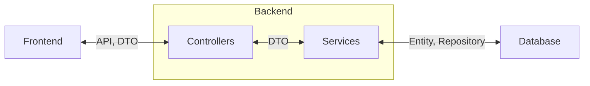

# HỆ THỐNG QUẢN LÝ BÁN HÀNG VÀ KHO HÀNG VÌ CỘNG ĐỒNG

    
    
    
    
    

Dự án Hệ thống Quản lý chuỗi cung ứng sản phẩm vì cộng đồng là một giải pháp số toàn diện nhằm tối ưu hóa quá trình quản lý chuỗi sản phẩm do người yếu thế tạo ra. Bao gồm các khâu quản lý nguyên vật liệu, sản xuất sản phẩm đến phân phối sản phẩm, giao dịch bán hàng, hạch toán tài chính,...

Các hệ thống hiện nay nhìn chung chỉ chú trọng ở khâu phân phối sản phẩm, vẫn còn nhiều hạn chế như chưa tối ưu trải nghiệm người dùng, thiếu tính minh bạch về thông tin và nguồn gốc của sản phẩm, cơ cấu quản lý có tính phân tán cao,...

**Những gì hệ thống mới sẽ đạt được**: Quản lý sản phẩm từ nhiều nguồn khác nhau một cách tập trung và thống nhất, tối ưu hóa trải nghiệm người dùng, đảm bảo tính minh bạch trong tất cả các khâu và thông tin và hệ thống cung cấp. Qua đó, nâng cao tính cạnh tranh và góp phần gia tăng niềm tin và hiệu quả hỗ trợ cộng đồng.

### Kiến trúc hệ thống

### Hướng dẫn sử dụng dự án

- [`/docs/backend-instruction.md`](/docs/backend-instruction.md): Hướng dẫn cài đặt và sử dụng _backend_.
- [`/docs/frontend-instruction.md`](/docs/frontend-instruction.md): Hướng dẫn cài đặt và sử dụng _frontend_.
- [`/docs/database-instruction.md`](/docs/database-instruction.md): Hướng dẫn cài đặt và sử dụng _database Docker_.
- [`/docs/rules.md`](/docs/rules.md): Các chuẩn chung khi sử dụng repository.
