# TÀI LIỆU ĐẶC TẢ GIAO DIỆN NGƯỜI DÙNG (UI SPECIFICATION)

**Hệ thống:** SGFMS – Sales & Inventory Management System  
**Phiên bản:** 1.0  
**Ngày lập:** 01/06/2026  
**Người lập:** System Analyst Agent  
**Công nghệ:** React 18 + TypeScript + Vite + Tailwind CSS + shadcn/ui  

---

## MỤC LỤC

1. [SignIn – Đăng nhập](#1-signin--đăng-nhập)
2. [Home / Dashboard – Trang chủ](#2-home--dashboard--trang-chủ)
3. [NotificationManagementPage – Quản lý thông báo](#3-notificationmanagementpage--quản-lý-thông-báo)
4. [EmpInfoPage – Thông tin cá nhân nhân viên](#4-empinfopage--thông-tin-cá-nhân-nhân-viên)
5. [EmpManagementPage – Quản lý nhân viên](#5-empmanagementpage--quản-lý-nhân-viên)
6. [CompManagementPage – Quản lý đối tác vận chuyển](#6-compmanagementpage--quản-lý-đối-tác-vận-chuyển)
7. [CustomerManagementPage – Quản lý khách hàng](#7-customermanagementpage--quản-lý-khách-hàng)
8. [CatManagementPage – Quản lý danh mục sản phẩm](#8-catmanagementpage--quản-lý-danh-mục-sản-phẩm)
9. [ProductManagementPage – Quản lý sản phẩm](#9-productmanagementpage--quản-lý-sản-phẩm)
10. [InvoiceManagementPage – Quản lý hóa đơn](#10-invoicemanagementpage--quản-lý-hóa-đơn)
11. [OrderManagementPage – Quản lý đơn hàng](#11-ordermanagementpage--quản-lý-đơn-hàng)
12. [WarehouseManagementPage – Quản lý kho hàng](#12-warehousemanagementpage--quản-lý-kho-hàng)
13. [RequestManagementPage – Quản lý yêu cầu đề xuất bổ sung](#13-requestmanagementpage--quản-lý-yêu-cầu-đề-xuất-bổ-sung)
14. [ImportReceiptManagementPage – Quản lý phiếu nhập kho](#14-importreceiptmanagementpage--quản-lý-phiếu-nhập-kho)
15. [ShippingManagementPage – Quản lý giao vận](#15-shippingmanagementpage--quản-lý-giao-vận)
16. [RevenueReportPage – Báo cáo doanh thu](#16-revenuereportpage--báo-cáo-doanh-thu)
17. [InvoiceSearchPage – Tra cứu hóa đơn (Kế toán)](#17-invoicesearchpage--tra-cứu-hóa-đơn-kế-toán)

**PHẦN II – THÀNH PHẦN ẨN (DIALOG / MODAL)**

**Nhóm Quản lý nhân viên**
- 18. [NewEmpDialog – Thêm nhân viên mới](#newempdialog--thêm-nhân-viên-mới)
- 19. [EditEmpDialog – Cập nhật thông tin nhân viên](#editempdialog--cập-nhật-thông-tin-nhân-viên)
- 20. [EditRoleDialog – Cập nhật phân quyền nhân viên](#editroledialog--cập-nhật-phân-quyền-nhân-viên)

**Nhóm Quản lý đối tác vận chuyển**
- 21. [NewCompDialog – Thêm đối tác mới](#newcompdialog--thêm-đối-tác-vận-chuyển-mới)
- 22. [DetailCompDialog – Chi tiết đối tác](#detailcompdialog--chi-tiết-đối-tác-vận-chuyển)
- 23. [EditCompDialog – Chỉnh sửa đối tác](#editcompdialog--chỉnh-sửa-đối-tác-vận-chuyển)

**Nhóm Quản lý khách hàng**
- 24. [NewCustomerDialog – Thêm khách hàng mới](#newcustomerdialog--thêm-khách-hàng-mới)
- 25. [DetailCustomerDialog – Chi tiết khách hàng](#detailcustomerdialog--chi-tiết-khách-hàng)
- 26. [EditCustomerDialog – Chỉnh sửa khách hàng](#editcustomerdialog--chỉnh-sửa-thông-tin-khách-hàng)
- 27. [OrderHistoryDialog – Lịch sử đơn hàng](#orderhistorydialog--lịch-sử-đơn-hàng-khách-hàng)
- 28. [FeedbackDialog – Ghi nhận phản hồi](#feedbackdialog--ghi-nhận-phản-hồi-khách-hàng)
- 29. [NewCustomerTypeDialog – Thêm nhóm KH](#newcustomertypedialog--thêm-nhóm-khách-hàng-mới)

**Nhóm Quản lý danh mục & sản phẩm**
- 30. [NewCatDialog – Thêm danh mục mới](#newcatdialog--thêm-danh-mục-sản-phẩm-mới)
- 31. [EditCatDialog – Chỉnh sửa danh mục](#editcatdialog--chỉnh-sửa-danh-mục-sản-phẩm)
- 32. [NewProductTypeDialog – Thêm loại sản phẩm](#newproducttypedialog--thêm-loại-sản-phẩm-mới)
- 33. [NewProductDialog – Tạo mới sản phẩm](#newproductdialog--tạo-mới-sản-phẩm)
- 34. [EditProductDialog – Chỉnh sửa sản phẩm](#editproductdialog--chỉnh-sửa-sản-phẩm)
- 35. [DetailProductDialog – Chi tiết sản phẩm](#detailproductdialog--chi-tiết-sản-phẩm)

**Nhóm Quản lý đơn hàng & hóa đơn**
- 36. [NewOrderDialog – Tạo đơn hàng](#neworderdialog--tạo-đơn-hàng)
- 37. [DetailOrderDialog – Chi tiết đơn hàng](#detailorderdialog--chi-tiết-đơn-hàng)
- 38. [EditOrderDialog – Cập nhật đơn hàng](#editorderdialog--cập-nhật-đơn-hàng)
- 39. [CancelReasonDialog – Hủy đơn hàng](#cancelreasondialog--nhập-lý-do-hủy-đơn-hàng)
- 40. [DetailInvoiceDialog – Chi tiết hóa đơn](#detailinvoicedialog--chi-tiết-hóa-đơn)
- 41. [PrintInvoiceDialog – In hóa đơn](#printinvoicedialog--in-hóa-đơn)

**Nhóm Quản lý chính sách & khuyến mãi**
- 42. [NewDiscountDialog – Tạo khuyến mãi](#newdiscountdialog--tạo-chương-trình-khuyến-mãi)
- 43. [NewPolicyDialog – Tạo chính sách đổi trả](#newpolicydialog--tạo-chính-sách-đổi-trả)
- 44. [EditPolicyDialog – Chỉnh sửa chính sách](#editpolicydialog--chỉnh-sửa-chính-sách-đổi-trả)
- 45. [DetailPolicyDialog – Chi tiết chính sách](#detailpolicydialog--chi-tiết-chính-sách-đổi-trả)
- 46. [NewOrderReturnDialog – Tạo phiếu đổi trả](#newordereturndialog--tạo-phiếu-đổihoàn-trả)

**Nhóm Quản lý kho hàng**
- 47. [NewWarehouseDialog – Thêm kho hàng mới](#newwarehousedialog--thêm-kho-hàng-mới)
- 48. [DetailWarehouseDialog – Chi tiết kho hàng](#detailwarehousedialog)
- 49. [EditWarehouseDialog – Chỉnh sửa kho hàng](#editwarehousedialog)
- 50. [ReportWarehouseDialog – Báo cáo thiếu hụt](#reportwarehousedialog--báo-cáo-thiếu-hụt-kho)

**Nhóm Quản lý phiếu lưu hành**
- 51. [NewRequestDialog – Tạo yêu cầu bổ sung](#newrequestdialog--tạo-yêu-cầu-bổ-sung)
- 52. [DetailRequestDialog – Chi tiết / Phê duyệt yêu cầu](#detailrequestdialog--chi-tiếtphê-duyệt-yêu-cầu-bổ-sung)
- 53. [NewImportReceiptDialog – Tạo phiếu nhập kho](#newimportreceiptdialog--tạo-phiếu-nhập-kho)
- 54. [DetailImportReceiptDialog – Chi tiết / Phê duyệt phiếu nhập](#detailimportreceiptdialog--chi-tiếtphê-duyệt-phiếu-nhập-kho)
- 55. [NewExportReceiptDialog – Tạo phiếu xuất kho](#newexportreceiptdialog--tạo-phiếu-xuất-kho)
- 56. [NewCountsheetDialog – Tạo phiếu kiểm kê](#newcountsheetdialog--tạo-phiếu-kiểm-kê)
- 57. [NewTransferTicketDialog – Tạo phiếu điều chuyển](#newtransferticketdialog--tạo-phiếu-điều-chuyển-kho)
- 58. [DetailTransferTicketDialog – Chi tiết phiếu điều chuyển](#detailtransferticketdialog--chi-tiết-phiếu-điều-chuyển)

**Nhóm Quản lý giao vận**
- 59. [DispatchDialog – Điều phối giao vận](#dispatchdialog--điều-phối-giao-vận)
- 60. [CancelShipDialog – Hủy giao vận](#cancelreasondialog--nhập-lý-do-hủy-đơn-hàng)

---

## 1. SignIn – Đăng nhập

**Đường dẫn:** `/signin`  
**File:** `frontend/src/pages/SignIn.tsx`  
**Mô tả:** Màn hình đăng nhập hệ thống SGFMS dành cho nhân viên, sử dụng số điện thoại và mật khẩu.

### Hình ảnh minh họa

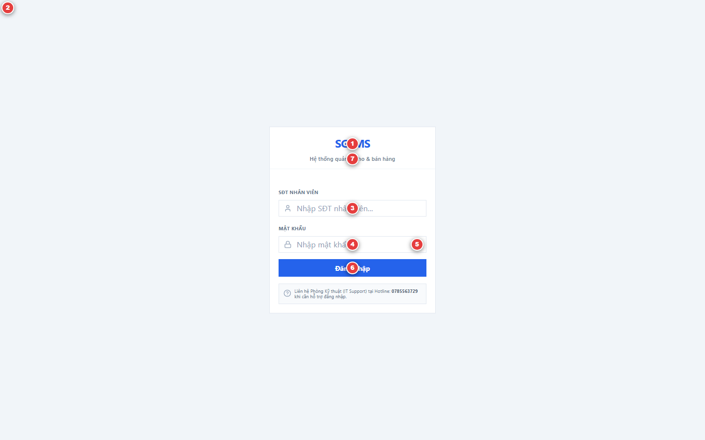

### Bảng mô tả thành phần

| STT | Tên thành phần | Kiểu | Chức năng |
|-----|----------------|------|-----------|
| 1 | lblTitleSgfms | Title | Hiển thị tiêu đề hệ thống "SGFMS" với màu xanh (blue-600), font đậm |
| 2 | lblSubtitleSystem | Label | Hiển thị mô tả ngắn "Hệ thống quản lý kho & bán hàng" dưới tiêu đề |
| 3 | txtEmployeePhone | Input | Cho phép nhân viên nhập số điện thoại đăng nhập (username). Có icon User ở bên trái, placeholder "Nhập SĐT nhân viên...", bắt buộc điền |
| 4 | txtPassword | Input | Cho phép nhân viên nhập mật khẩu (type=password hoặc text tùy toggle). Có icon Lock ở bên trái, placeholder "Nhập mật khẩu...", bắt buộc điền |
| 5 | btnTogglePassword | Button | Icon Eye/EyeOff để chuyển đổi hiển thị/ẩn mật khẩu. Hiển thị icon Eye khi mật khẩu đang ẩn, icon EyeOff khi đang hiện |
| 6 | btnLogin | Button | Nút "Đăng nhập" xanh. Khi nhấn gọi API `POST /auth/signin` với username và password. Trạng thái loading hiển thị "Đang đăng nhập...". Sau khi thành công, điều hướng về trang `/` |
| 7 | lblItSupport | Label | Hộp thông tin IT Support với icon HelpCircle, hiển thị số hotline hỗ trợ đăng nhập: 0785563729 |

---

## 2. Home / Dashboard – Trang chủ

**Đường dẫn:** `/`  
**File:** `frontend/src/pages/Home.tsx`, `frontend/src/pages/Dashboard.tsx`  
**Mô tả:** Trang chào mừng hiển thị thông tin nhân viên đăng nhập. Đối với Quản lý (RoleID=1) hiển thị thêm Dashboard với KPI và biểu đồ báo cáo kinh doanh.

### Hình ảnh minh họa

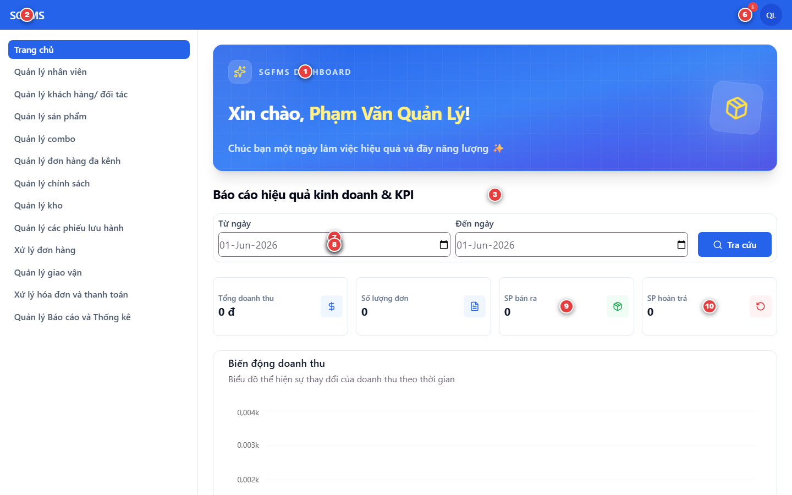

### Bảng mô tả thành phần

| STT | Tên thành phần | Kiểu | Chức năng |
|-----|----------------|------|-----------|
| 1 | lblSgfmsDashboard | Label | Banner gradient xanh hiển thị nhãn "SGFMS Dashboard" với icon Sparkles |
| 2 | lblGreeting | Title | Hiển thị lời chào "Xin chào, [Tên nhân viên]!" lấy từ context (Dữ liệu động) |
| 3 | lblSubtitleMotivate | Label | Câu chúc làm việc hiệu quả bên dưới lời chào |
| 4 | lblSectionTitle | Title | Tiêu đề section "Báo cáo hiệu quả kinh doanh & KPI" — chỉ hiển thị khi người dùng có quyền Quản lý (hasRole(1)) |
| 5 | dtpStartDate | DatePicker | Chọn ngày bắt đầu lọc dữ liệu báo cáo. Mặc định là ngày hiện tại |
| 6 | dtpEndDate | DatePicker | Chọn ngày kết thúc lọc dữ liệu báo cáo. Mặc định là ngày hiện tại |
| 7 | btnSearchDashboard | Button | Nút "Tra cứu" kích hoạt tải dữ liệu Dashboard theo khoảng thời gian đã chọn. Validate ngày bắt đầu ≤ ngày kết thúc |
| 8 | cardTotalRevenue | Card | KPI Card hiển thị "Tổng doanh thu" (Dữ liệu động), icon DollarSign màu xanh |
| 9 | cardTotalOrders | Card | KPI Card hiển thị "Số lượng đơn" (Dữ liệu động), icon FileText |
| 10 | cardProductsSold | Card | KPI Card hiển thị "SP bán ra" (Dữ liệu động), icon Package màu xanh lá |
| 11 | cardProductsReturned | Card | KPI Card hiển thị "SP hoàn trả" (Dữ liệu động), icon RotateCcw màu đỏ |
| 12 | chartRevenueTrend | Chart | Biểu đồ đường (LineChart) thể hiện biến động doanh thu theo ngày (Dữ liệu động từ API) |
| 13 | chartOrdersVolume | Chart | Biểu đồ cột (BarChart) thể hiện số đơn hàng, số SP bán ra và số SP trả về theo ngày (Dữ liệu động) |

> **Ghi chú điều kiện render:** Section Dashboard (STT 4–13) chỉ hiển thị khi người dùng có RoleID = 1 (Quản lý). Nhân viên thường thấy banner chào mừng thay thế.

---

## 3. NotificationManagementPage – Quản lý thông báo

**Đường dẫn:** `/notification-management`  
**File:** `frontend/src/pages/0-notification-management/NotificationManagementPage.tsx`  
**Mô tả:** Màn hình quản lý thông báo hệ thống. Hiển thị danh sách thông báo được phân loại theo trạng thái đọc/chưa đọc, hỗ trợ đánh dấu đã đọc từng thông báo hoặc tất cả.

### Hình ảnh minh họa

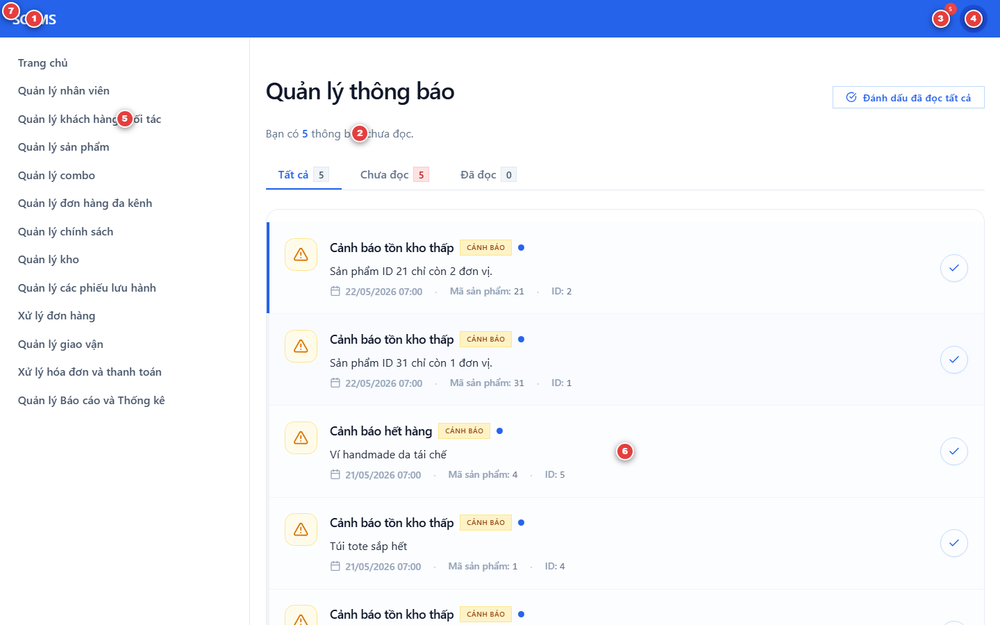

### Bảng mô tả thành phần

| STT | Tên thành phần | Kiểu | Chức năng |
|-----|----------------|------|-----------|
| 1 | lblPageTitle | Title | Tiêu đề trang "Quản lý thông báo" (h1, font-semibold) |
| 2 | lblUnreadCount | Label | Hiển thị số lượng thông báo chưa đọc: "Bạn có [N] thông báo chưa đọc." (Dữ liệu động) |
| 3 | btnMarkAllRead | Button | Nút "Đánh dấu đã đọc tất cả" (với icon CheckCircle). Chỉ hiển thị khi có ít nhất 1 thông báo chưa đọc. Gọi API đánh dấu toàn bộ |
| 4 | tabAll | Tab | Tab "Tất cả" — hiển thị toàn bộ thông báo, có Badge đếm tổng số |
| 5 | tabUnread | Tab | Tab "Chưa đọc" — lọc chỉ hiển thị thông báo chưa đọc (Status=0), Badge màu đỏ |
| 6 | tabRead | Tab | Tab "Đã đọc" — lọc chỉ hiển thị thông báo đã đọc (Status=1) |
| 7 | listNotifications | List | Danh sách thông báo (Dữ liệu động từ API). Mỗi item gồm: icon loại thông báo, tiêu đề, nội dung, ngày tạo, mã sản phẩm (nếu có), ID thông báo. Thông báo chưa đọc có viền trái màu xanh và nền xanh nhạt |
| 8 | bdgNotificationType | Badge | Badge hiển thị loại thông báo: Cảnh báo (amber), Giao dịch (emerald), Yêu cầu (blue), Hệ thống (slate) |
| 9 | btnMarkAsRead | Button | Nút icon tròn (Check) để đánh dấu đã đọc từng thông báo. Chỉ hiển thị trên thông báo chưa đọc. Khi đã đọc, hiển thị icon Check màu xanh lá |

---

## 4. EmpInfoPage – Thông tin cá nhân nhân viên

**Đường dẫn:** `/profile`  
**File:** `frontend/src/pages/1-emp-info/EmpInfoPage.tsx`  
**Mô tả:** Màn hình hiển thị thông tin hồ sơ cá nhân của nhân viên đang đăng nhập. Hỗ trợ chỉnh sửa thông tin qua dialog.

### Hình ảnh minh họa

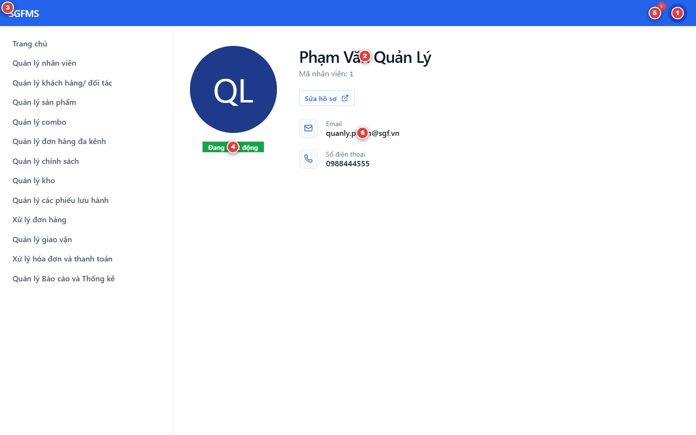

### Bảng mô tả thành phần

| STT | Tên thành phần | Kiểu | Chức năng |
|-----|----------------|------|-----------|
| 1 | imgAvatar | Image | Hiển thị avatar nhân viên (ký tự viết tắt từ tên), kích thước 160×160px (h-40 w-40). Dữ liệu động từ context |
| 2 | bdgStatus | Badge | Badge trạng thái nhân viên: "Đang hoạt động" (xanh lá) hoặc "Nghỉ việc" (xám). Điều kiện: emp.Status === 1 |
| 3 | lblFullname | Title | Tên đầy đủ của nhân viên (h2, font-semibold 3xl). Dữ liệu động |
| 4 | lblEmployeeID | Label | Hiển thị "Mã nhân viên: [ID]". Dữ liệu động |
| 5 | btnEditProfile | Button | Nút "Sửa hồ sơ" với icon ExternalLink. Mở dialog EditEmpDialog để chỉnh sửa thông tin |
| 6 | lblEmail | Link | Hiển thị địa chỉ email nhân viên (Dữ liệu động). Click để mở client email (mailto:) |
| 7 | lblPhone | Label | Hiển thị số điện thoại của nhân viên (Dữ liệu động) |
| 8 | mdlEditEmpDialog | Modal | Dialog chỉnh sửa thông tin nhân viên (mở khi nhấn btnEditProfile). Cho phép cập nhật Email, SĐT |

---

## 5. EmpManagementPage – Quản lý nhân viên

**Đường dẫn:** `/emp-management`  
**File:** `frontend/src/pages/2-emp-management/EmpManagementPage.tsx`  
**Mô tả:** Màn hình quản lý danh sách nhân viên hệ thống (không bao gồm nhân viên có quyền Quản lý RoleID=1). Hỗ trợ tìm kiếm, phân trang, thêm mới, cập nhật thông tin, sửa quyền và đổi trạng thái hoạt động.

### Hình ảnh minh họa

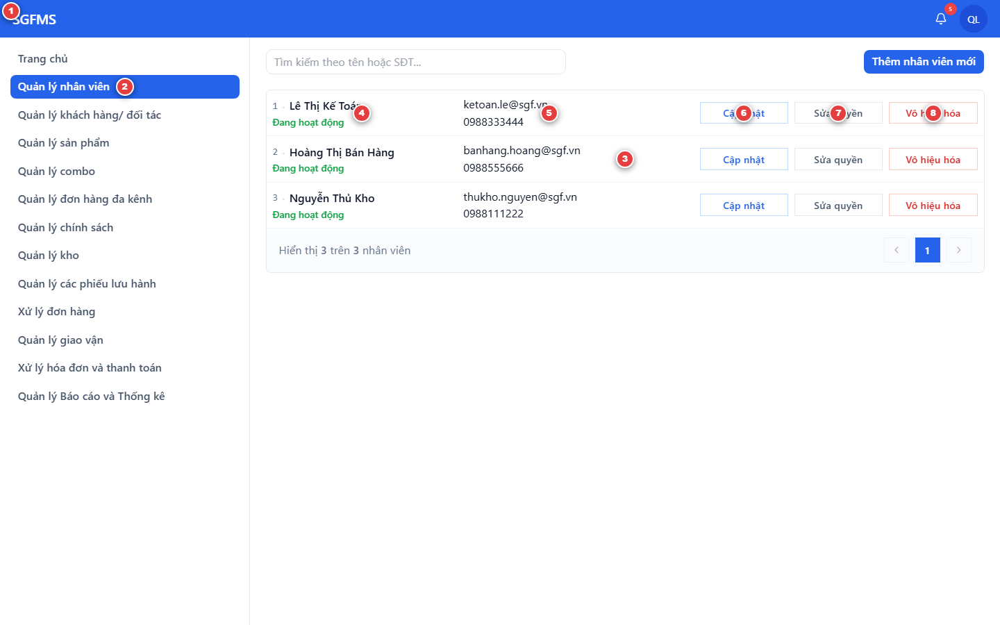

### Bảng mô tả thành phần

| STT | Tên thành phần | Kiểu | Chức năng |
|-----|----------------|------|-----------|
| 1 | txtSearchEmp | Input | Ô tìm kiếm nhân viên theo tên hoặc số điện thoại. Placeholder "Tìm kiếm theo tên hoặc SĐT...". Reset về trang 1 khi thay đổi |
| 2 | btnAddEmp | Button | Nút "Thêm nhân viên mới" (xanh). Mở dialog NewEmpDialog |
| 3 | tblEmployees | Table | Bảng danh sách nhân viên (Dữ liệu động từ API). Phân trang 20 bản ghi/trang. Không hiển thị nhân viên có RoleID=1 |
| 4 | lblEmpInfo | Label | Cột thông tin nhân viên: STT, Tên đầy đủ, trạng thái Đang hoạt động/Nghỉ việc |
| 5 | lblContactInfo | Label | Cột thông tin liên hệ: Email và Số điện thoại |
| 6 | btnUpdateEmp | Button | Nút "Cập nhật" — mở dialog EditEmpDialog. Bị vô hiệu hóa khi nhân viên có Status=0 (Nghỉ việc) |
| 7 | btnEditRole | Button | Nút "Sửa quyền" — mở dialog EditRoleDialog để thay đổi vai trò nhân viên. Bị vô hiệu hóa khi Status=0 |
| 8 | btnToggleStatus | Button | Nút "Vô hiệu hóa" (đỏ) hoặc "Kích hoạt lại" (xanh xám). Cập nhật trạng thái nhân viên ngay lập tức qua API |
| 9 | pagEmployees | Pagination | Bộ điều hướng phân trang: Nút lùi (ChevronLeft), danh sách số trang, nút tiến (ChevronRight). Hiển thị "Hiển thị N trên M nhân viên" |
| 10 | mdlNewEmpDialog | Modal | Dialog thêm nhân viên mới |
| 11 | mdlEditEmpDialog | Modal | Dialog cập nhật thông tin nhân viên được chọn |
| 12 | mdlEditRoleDialog | Modal | Dialog chỉnh sửa vai trò/quyền hạn của nhân viên |

---

## 6. CompManagementPage – Quản lý đối tác vận chuyển

**Đường dẫn:** `/customer-partner-management?tab=partners`  
**File:** `frontend/src/pages/3-comp-management/CompManagementPage.tsx`  
**Mô tả:** Màn hình quản lý danh sách đối tác vận chuyển (Shipping Company). Hỗ trợ xem chi tiết, cập nhật thông tin và thay đổi trạng thái hợp tác.

### Hình ảnh minh họa

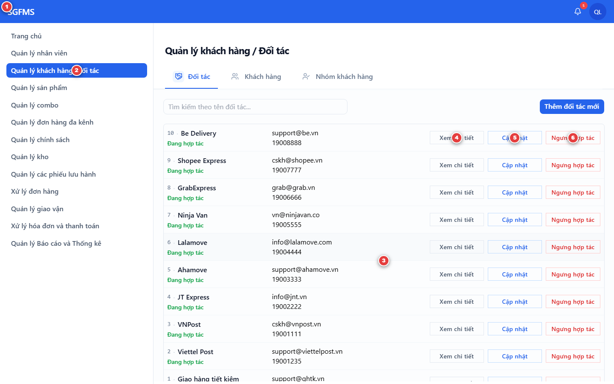

### Bảng mô tả thành phần

| STT | Tên thành phần | Kiểu | Chức năng |
|-----|----------------|------|-----------|
| 1 | txtSearchComp | Input | Ô tìm kiếm đối tác theo tên công ty. Placeholder "Tìm kiếm theo tên đối tác..." |
| 2 | btnAddComp | Button | Nút "Thêm đối tác mới" (xanh). Mở dialog NewCompDialog |
| 3 | tblPartners | Table | Bảng danh sách đối tác vận chuyển (Dữ liệu động). Hiển thị: ID, Tên công ty, trạng thái, Email, SĐT. Phân trang 20 bản ghi/trang |
| 4 | btnViewDetail | Button | Nút "Xem chi tiết" — mở dialog DetailCompDialog hiển thị thông tin đầy đủ của đối tác |
| 5 | btnUpdateComp | Button | Nút "Cập nhật" — mở dialog EditCompDialog. Bị vô hiệu hóa khi đối tác có Status=0 |
| 6 | btnToggleCompStatus | Button | Nút "Ngưng hợp tác" (đỏ) hoặc "Hợp tác lại" (xám). Cập nhật trạng thái hợp tác ngay lập tức |
| 7 | pagPartners | Pagination | Bộ điều hướng phân trang đối tác |
| 8 | mdlDetailCompDialog | Modal | Dialog xem chi tiết thông tin đối tác |
| 9 | mdlEditCompDialog | Modal | Dialog chỉnh sửa thông tin đối tác |
| 10 | mdlNewCompDialog | Modal | Dialog thêm đối tác vận chuyển mới |

---

## 7. CustomerManagementPage – Quản lý khách hàng

**Đường dẫn:** `/customer-partner-management?tab=customers`  
**File:** `frontend/src/pages/4-customer-management-page/CustomerManagementPage.tsx`  
**Mô tả:** Màn hình quản lý danh sách khách hàng. Hỗ trợ xem chi tiết, cập nhật, xem lịch sử đơn hàng và ghi nhận phản hồi từ khách hàng đã có đơn giao thành công.

### Hình ảnh minh họa

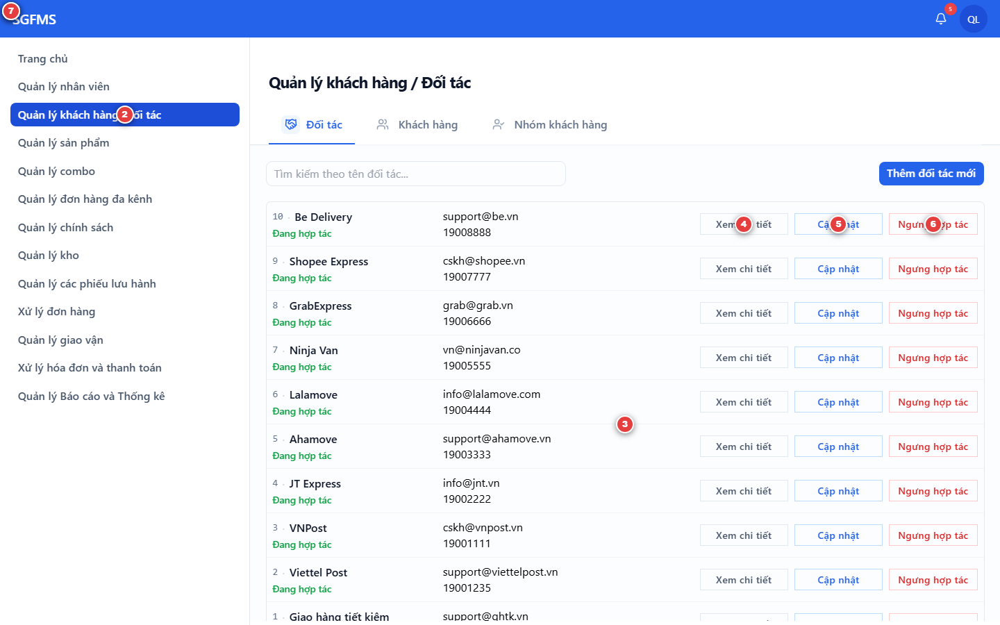

### Bảng mô tả thành phần

| STT | Tên thành phần | Kiểu | Chức năng |
|-----|----------------|------|-----------|
| 1 | txtSearchCustomer | Input | Ô tìm kiếm khách hàng theo tên. Placeholder "Tìm kiếm khách hàng..." |
| 2 | btnAddCustomer | Button | Nút "Thêm khách hàng mới" (xanh). Mở dialog NewCustomerDialog |
| 3 | tblCustomers | Table | Bảng danh sách khách hàng (Dữ liệu động). Hiển thị: ID, Họ tên. Phân trang 10 bản ghi/trang |
| 4 | btnViewDetailCustomer | Button | Nút "Xem chi tiết" — mở DetailCustomerDialog |
| 5 | btnUpdateCustomer | Button | Nút "Cập nhật" — mở EditCustomerDialog |
| 6 | btnFeedback | Button | Nút "Phản hồi" — mở FeedbackDialog. Chỉ có thể nhấn khi khách hàng có đơn giao thành công (shippingstatus=3) hoặc hóa đơn tại quầy đã thanh toán. Nếu không đủ điều kiện, nút bị mờ (opacity-40) và không thể click |
| 7 | btnOrderHistory | Button | Nút "Lịch sử" — mở OrderHistoryDialog xem lịch sử đơn hàng của khách hàng |
| 8 | pagCustomers | Pagination | Bộ điều hướng phân trang khách hàng |
| 9 | mdlNewCustomerDialog | Modal | Dialog thêm khách hàng mới |
| 10 | mdlDetailCustomerDialog | Modal | Dialog xem chi tiết thông tin khách hàng |
| 11 | mdlEditCustomerDialog | Modal | Dialog chỉnh sửa thông tin khách hàng |
| 12 | mdlFeedbackDialog | Modal | Dialog ghi nhận phản hồi/đánh giá từ khách hàng |
| 13 | mdlOrderHistoryDialog | Modal | Dialog xem lịch sử đơn hàng của khách hàng |

---

## 8. CatManagementPage – Quản lý danh mục sản phẩm

**Đường dẫn:** `/product-management?tab=categories`  
**File:** `frontend/src/pages/5.1-category-management-page/CatManagementPage.tsx`  
**Mô tả:** Màn hình quản lý danh mục sản phẩm. Cho phép xem, thêm, sửa và xóa danh mục. Danh mục có loại sản phẩm con không thể xóa.

### Hình ảnh minh họa

### Bảng mô tả thành phần

| STT | Tên thành phần | Kiểu | Chức năng |
|-----|----------------|------|-----------|
| 1 | txtSearchCat | Input | Ô tìm kiếm danh mục theo tên. Placeholder "Tìm kiếm danh mục..." |
| 2 | btnAddCat | Button | Nút "Thêm danh mục mới" (xanh). Mở dialog NewCatDialog |
| 3 | tblCategories | Table | Bảng danh sách danh mục (Dữ liệu động). Hiển thị: ID, Tên danh mục, Số lượng loại sản phẩm. Phân trang 10 bản ghi/trang |
| 4 | btnViewDetailCat | Button | Nút "Xem chi tiết" với icon Eye — mở DetailCatDialog |
| 5 | btnUpdateCat | Button | Nút "Cập nhật" — mở EditCatDialog để sửa tên danh mục |
| 6 | btnDeleteCat | Button | Nút "Xóa" với icon Trash2 (đỏ). Xóa danh mục sau khi xác nhận. Bị vô hiệu hóa và mờ khi danh mục có loại sản phẩm con (tCount > 0) |
| 7 | pagCategories | Pagination | Bộ điều hướng phân trang danh mục |
| 8 | mdlNewCatDialog | Modal | Dialog thêm danh mục mới |
| 9 | mdlEditCatDialog | Modal | Dialog chỉnh sửa tên danh mục |
| 10 | mdlDetailCatDialog | Modal | Dialog xem chi tiết danh mục và các loại sản phẩm bên trong |

---

## 9. ProductManagementPage – Quản lý sản phẩm

**Đường dẫn:** `/product-management?tab=products`  
**File:** `frontend/src/pages/6.1-product-management/ProductManagementPage.tsx`  
**Mô tả:** Màn hình quản lý danh sách sản phẩm. Hiển thị thông tin sản phẩm bao gồm danh mục, loại, số lượng tồn kho theo từng loại kho và giá. Hỗ trợ xem chi tiết, chỉnh sửa và chuyển đổi trạng thái kinh doanh.

### Hình ảnh minh họa

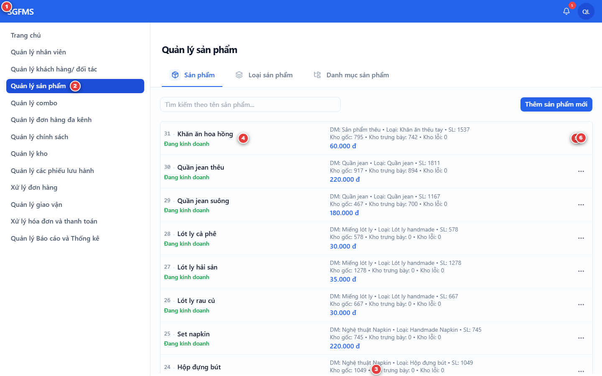

### Bảng mô tả thành phần

| STT | Tên thành phần | Kiểu | Chức năng |
|-----|----------------|------|-----------|
| 1 | txtSearchProduct | Input | Ô tìm kiếm sản phẩm theo tên. Placeholder "Tìm kiếm theo tên sản phẩm..." |
| 2 | btnAddProduct | Button | Nút "Thêm sản phẩm mới" (xanh). Mở dialog NewProductDialog |
| 3 | tblProducts | Table | Bảng danh sách sản phẩm (Dữ liệu động). Mỗi row hiển thị: ID, Tên, Trạng thái kinh doanh, Danh mục, Loại SP, Tổng SL, SL theo kho gốc/trưng bày/lỗi, Giá bán. Phân trang 20 bản ghi/trang |
| 4 | cboActionProduct | Dropdown | Dropdown menu (icon MoreHorizontal) chứa các hành động: Xem chi tiết, Chỉnh sửa, Ngừng/Kinh doanh lại |
| 5 | pagProducts | Pagination | Bộ điều hướng phân trang sản phẩm |
| 6 | mdlDetailProductDialog | Modal | Dialog xem chi tiết sản phẩm (thông tin đầy đủ, tồn kho) |
| 7 | mdlEditProductDialog | Modal | Dialog chỉnh sửa thông tin sản phẩm |
| 8 | mdlNewProductDialog | Modal | Dialog thêm sản phẩm mới |

---

## 10. InvoiceManagementPage – Quản lý hóa đơn

**Đường dẫn:** `/multichannel-order-management?tab=invoices`  
**File:** `frontend/src/pages/8.1-invoice-management-page/InvoiceManagementPage.tsx`  
**Mô tả:** Màn hình quản lý hóa đơn bán hàng từ tất cả kênh (tại quầy và trực tuyến). Hỗ trợ xem chi tiết, xác nhận thanh toán và in hóa đơn. Sắp xếp hóa đơn mới nhất lên trên.

### Hình ảnh minh họa

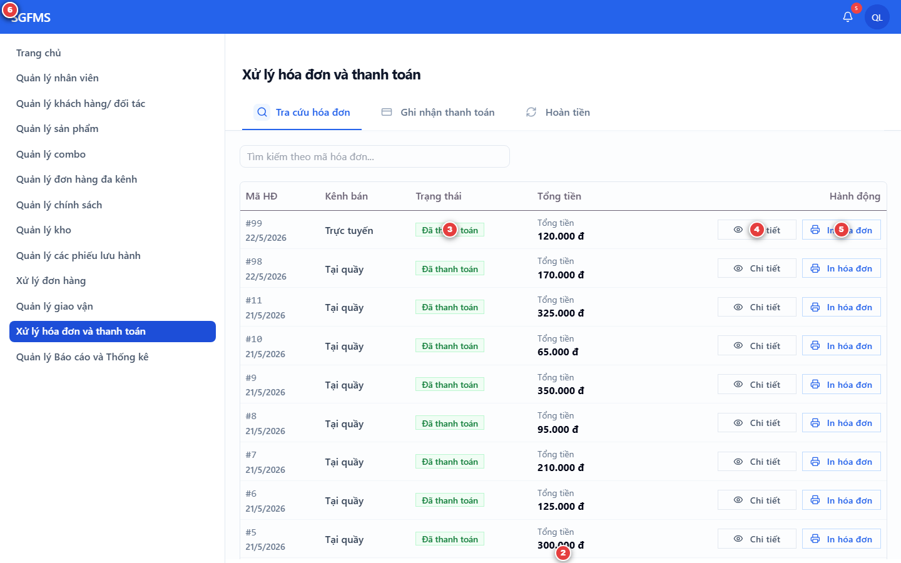

### Bảng mô tả thành phần

| STT | Tên thành phần | Kiểu | Chức năng |
|-----|----------------|------|-----------|
| 1 | txtSearchInvoice | Input | Ô tìm kiếm theo mã hóa đơn. Placeholder "Tìm kiếm theo mã hóa đơn..." |
| 2 | tblInvoices | Table | Bảng danh sách hóa đơn (Dữ liệu động). Hiển thị: Mã HĐ, Ngày tạo, Kênh bán (Tại quầy/Mạng xã hội), Trạng thái, Tổng tiền. Phân trang 20 bản ghi/trang |
| 3 | bdgInvoiceStatus | Badge | Badge trạng thái hóa đơn: Chờ thanh toán (amber), Đã thanh toán (green), Thanh toán 1 phần (blue) |
| 4 | btnViewDetailInvoice | Button | Nút "Xem chi tiết" — mở DetailInvoiceDialog |
| 5 | btnConfirmPayment | Button | Nút "XN. thanh toán" — cập nhật trạng thái hóa đơn thành "Đã thanh toán". Bị vô hiệu hóa khi hóa đơn đã thanh toán. Chỉ hiển thị với người dùng không có RoleID=3 (Sales) |
| 6 | btnPrintInvoice | Button | Nút "In hóa đơn" với icon Printer (màu xanh lá). Mở dialog PrintInvoiceDialog |
| 7 | pagInvoices | Pagination | Bộ điều hướng phân trang hóa đơn |
| 8 | mdlDetailInvoiceDialog | Modal | Dialog xem chi tiết hóa đơn |
| 9 | mdlPrintInvoiceDialog | Modal | Dialog xem trước và in hóa đơn |

---

## 11. OrderManagementPage – Quản lý đơn hàng

**Đường dẫn:** `/multichannel-order-management?tab=orders` (và `?tab=online-orders`)  
**File:** `frontend/src/pages/8.2-order-management-page/OrderManagementPage.tsx`  
**Mô tả:** Màn hình quản lý đơn hàng đa kênh (tại quầy và online). Hiển thị trạng thái đơn hàng và trạng thái giao hàng. Hỗ trợ nhiều thao tác qua dropdown menu.

### Hình ảnh minh họa

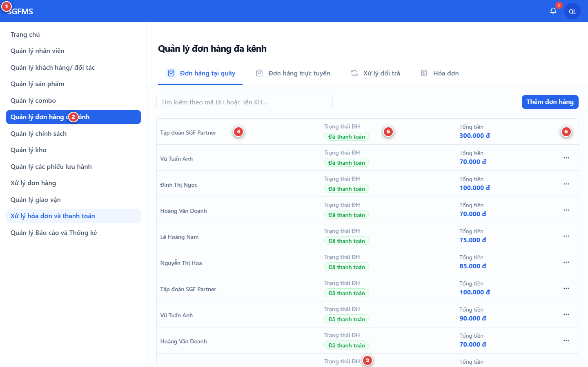

### Bảng mô tả thành phần

| STT | Tên thành phần | Kiểu | Chức năng |
|-----|----------------|------|-----------|
| 1 | txtSearchOrder | Input | Ô tìm kiếm theo mã đơn hàng hoặc tên khách hàng. Placeholder "Tìm kiếm theo mã ĐH hoặc Tên KH..." |
| 2 | btnAddOrder | Button | Nút "Thêm đơn hàng" (xanh). Mở dialog NewOrderDialog |
| 3 | tblOrders | Table | Bảng danh sách đơn hàng (Dữ liệu động). Hiển thị: Mã ĐH, Tên KH, Trạng thái ĐH, Trạng thái giao (chỉ kênh online), Tổng tiền. Phân trang 20 bản ghi/trang |
| 4 | bdgOrderStatus | Badge | Badge trạng thái đơn hàng: Chờ xác nhận (slate), Đã xác nhận (blue), Đang giao (yellow), Giao thành công/Đã TT (green), Đã hủy (red), Đổi/trả (purple) |
| 5 | bdgShippingStatus | Badge | Badge trạng thái giao hàng (chỉ kênh online): Cần lên lịch (slate), Đang đóng gói (blue), Đã gửi ĐVVC (indigo), Khách từ chối (red), Đã đóng gói (green) |
| 6 | cboOrderActions | Dropdown | Dropdown (icon MoreHorizontal) các hành động: XN tạo hóa đơn (online), Xem chi tiết, Cập nhật, Đóng gói xong, Hủy đơn hàng. Các tùy chọn bị vô hiệu hóa theo trạng thái đơn hàng |
| 7 | pagOrders | Pagination | Bộ điều hướng phân trang đơn hàng |
| 8 | mdlDetailOrderDialog | Modal | Dialog xem chi tiết đơn hàng |
| 9 | mdlNewOrderDialog | Modal | Dialog tạo đơn hàng mới |
| 10 | mdlEditOrderDialog | Modal | Dialog chỉnh sửa đơn hàng |
| 11 | mdlCancelReasonDialog | Modal | Dialog nhập lý do hủy đơn hàng |

---

## 12. WarehouseManagementPage – Quản lý kho hàng

**Đường dẫn:** `/warehouse-management`  
**File:** `frontend/src/pages/11.1-warehouse-management-page/WarehouseManagementPage.tsx`  
**Mô tả:** Màn hình quản lý danh sách kho hàng. Hỗ trợ xem chi tiết tồn kho, cập nhật thông tin, thêm kho mới và xem báo cáo thiếu hụt hàng.

### Hình ảnh minh họa

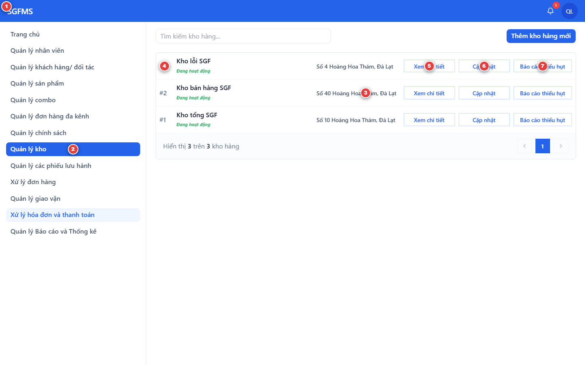

### Bảng mô tả thành phần

| STT | Tên thành phần | Kiểu | Chức năng |
|-----|----------------|------|-----------|
| 1 | txtSearchWarehouse | Input | Ô tìm kiếm kho theo tên. Placeholder "Tìm kiếm kho hàng..." |
| 2 | btnAddWarehouse | Button | Nút "Thêm kho hàng mới" (xanh). Mở dialog NewWarehouseDialog |
| 3 | tblWarehouses | Table | Bảng danh sách kho hàng (Dữ liệu động). Hiển thị: Mã kho (#ID), Tên kho, Trạng thái, Địa chỉ. Phân trang 10 bản ghi/trang |
| 4 | btnViewDetailWarehouse | Button | Nút "Xem chi tiết" — mở DetailWarehouseDialog |
| 5 | btnUpdateWarehouse | Button | Nút "Cập nhật" — mở EditWarehouseDialog |
| 6 | btnReportWarehouse | Button | Nút "Báo cáo thiếu hụt" — mở ReportWarehouseDialog hiển thị các sản phẩm có tồn kho dưới mức tối thiểu |
| 7 | pagWarehouses | Pagination | Bộ điều hướng phân trang kho hàng |
| 8 | mdlDetailWarehouseDialog | Modal | Dialog xem chi tiết thông tin và tồn kho của kho hàng |
| 9 | mdlEditWarehouseDialog | Modal | Dialog chỉnh sửa thông tin kho hàng (tên, địa chỉ, sản phẩm phân bổ) |
| 10 | mdlNewWarehouseDialog | Modal | Dialog thêm kho hàng mới |
| 11 | mdlReportWarehouseDialog | Modal | Dialog báo cáo thiếu hụt — danh sách sản phẩm dưới mức tồn kho tối thiểu |

---

## 13. RequestManagementPage – Quản lý yêu cầu đề xuất bổ sung

**Đường dẫn:** `/circulating-slips-management?tab=replenishment-requests`  
**File:** `frontend/src/pages/11.2-request-management-page/RequestManagementPage.tsx`  
**Mô tả:** Màn hình quản lý các yêu cầu đề xuất bổ sung vật tư. Nhân viên có thể tạo mới. Quản lý (RoleID=1) có thêm nút Phê duyệt để duyệt/từ chối yêu cầu.

### Hình ảnh minh họa

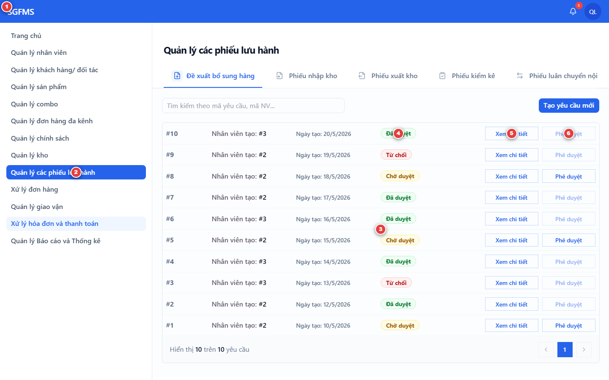

### Bảng mô tả thành phần

| STT | Tên thành phần | Kiểu | Chức năng |
|-----|----------------|------|-----------|
| 1 | txtSearchRequest | Input | Ô tìm kiếm theo mã yêu cầu hoặc mã nhân viên. Placeholder "Tìm kiếm theo mã yêu cầu, mã NV..." |
| 2 | btnCreateRequest | Button | Nút "Tạo yêu cầu mới" (xanh). Mở dialog NewRequestDialog |
| 3 | tblRequests | Table | Bảng danh sách yêu cầu đề xuất (Dữ liệu động). Hiển thị: Mã YC, Mã NV tạo, Ngày tạo, Trạng thái. Phân trang 10 bản ghi/trang |
| 4 | bdgRequestStatus | Badge | Badge trạng thái yêu cầu: Đã duyệt (green), Chờ duyệt (yellow), Từ chối (red) |
| 5 | btnViewDetailRequest | Button | Nút "Xem chi tiết" — mở DetailRequestDialog ở chế độ view |
| 6 | btnApproveRequest | Button | Nút "Phê duyệt" — mở DetailRequestDialog ở chế độ approve. Chỉ hiển thị với Quản lý (RoleID=1). Bị vô hiệu hóa khi yêu cầu đã được xử lý |
| 7 | pagRequests | Pagination | Bộ điều hướng phân trang yêu cầu |
| 8 | mdlDetailRequestDialog | Modal | Dialog xem chi tiết/phê duyệt yêu cầu đề xuất |
| 9 | mdlNewRequestDialog | Modal | Dialog tạo yêu cầu bổ sung mới |

---

## 14. ImportReceiptManagementPage – Quản lý phiếu nhập kho

**Đường dẫn:** `/circulating-slips-management?tab=import-receipts`  
**File:** `frontend/src/pages/12.1-importreceipt-management-page/ImportReceiptManagementPage.tsx`  
**Mô tả:** Màn hình quản lý phiếu nhập kho. Hỗ trợ tạo mới, xem chi tiết. Thủ kho (RoleID=2) có thể đánh dấu đã đếm xong. Quản lý (RoleID=1) phê duyệt phiếu nhập. Phiếu có flag lệch kho được đánh dấu đặc biệt.

### Hình ảnh minh họa

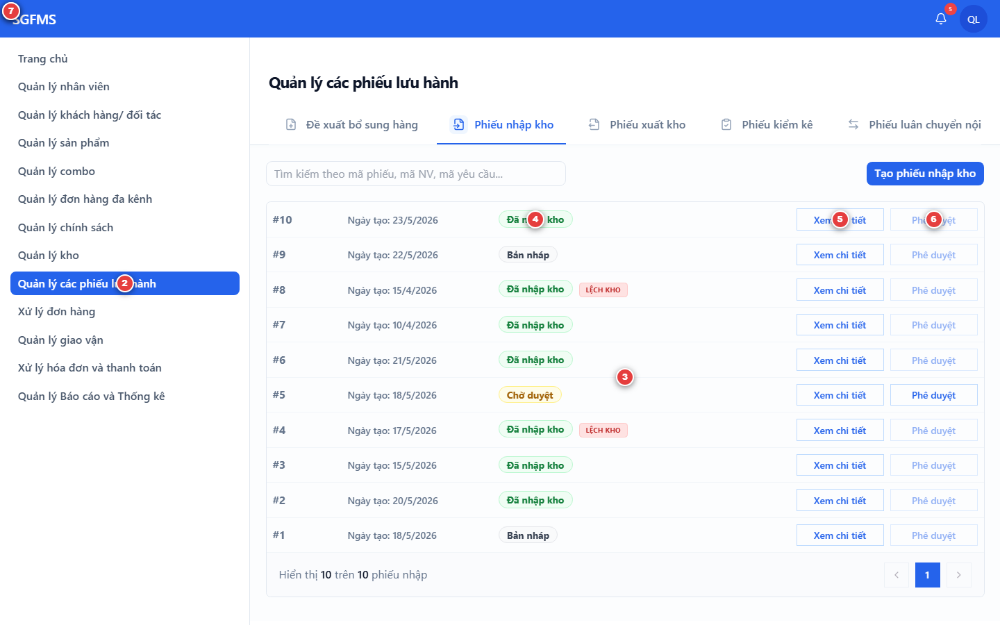

### Bảng mô tả thành phần

| STT | Tên thành phần | Kiểu | Chức năng |
|-----|----------------|------|-----------|
| 1 | txtSearchImportReceipt | Input | Ô tìm kiếm theo mã phiếu, mã nhân viên hoặc mã yêu cầu. Placeholder "Tìm kiếm theo mã phiếu, mã NV, mã yêu cầu..." |
| 2 | btnCreateImportReceipt | Button | Nút "Tạo phiếu nhập kho" (xanh). Mở dialog NewImportReceiptDialog |
| 3 | tblImportReceipts | Table | Bảng danh sách phiếu nhập (Dữ liệu động). Hiển thị: Mã phiếu, Ngày tạo, Trạng thái, Flag lệch kho. Phân trang 10 bản ghi/trang |
| 4 | bdgImportStatus | Badge | Badge trạng thái phiếu: Bản nháp (gray), Đã nhập kho (green), Chờ duyệt (yellow), Đã từ chối (red) |
| 5 | bdgDiscrepancy | Badge | Badge "Lệch kho" màu đỏ — hiển thị khi phiếu có HasDiscrepancy=1 |
| 6 | btnViewDetailImport | Button | Nút "Xem chi tiết" — mở DetailImportReceiptDialog ở chế độ view |
| 7 | btnConfirmCounted | Button | Nút "Đã đếm xong" — cập nhật trạng thái phiếu sang "Chờ duyệt". Chỉ hiển thị với Thủ kho (RoleID=2). Chỉ có thể nhấn khi Status="Bản nháp" |
| 8 | btnApproveImport | Button | Nút "Phê duyệt" — mở dialog ở chế độ approve. Chỉ hiển thị với Quản lý (RoleID=1). Chỉ có thể nhấn khi Status="Chờ duyệt" |
| 9 | pagImportReceipts | Pagination | Bộ điều hướng phân trang phiếu nhập |
| 10 | mdlDetailImportDialog | Modal | Dialog xem chi tiết/phê duyệt phiếu nhập kho |
| 11 | mdlNewImportDialog | Modal | Dialog tạo phiếu nhập kho mới |

---

## 15. ShippingManagementPage – Quản lý giao vận

**Đường dẫn:** `/shipping-management`  
**File:** `frontend/src/pages/17-shipping-management/ShippingManagementPage.tsx`  
**Mô tả:** Màn hình theo dõi và xử lý giao vận cho đơn hàng online. Có 2 tab: "Chờ giao vận" và "Hủy chờ tháo dỡ". Phân quyền theo vai trò: Thủ kho đẩy đơn, Sales/Quản lý hủy giao vận.

### Hình ảnh minh họa

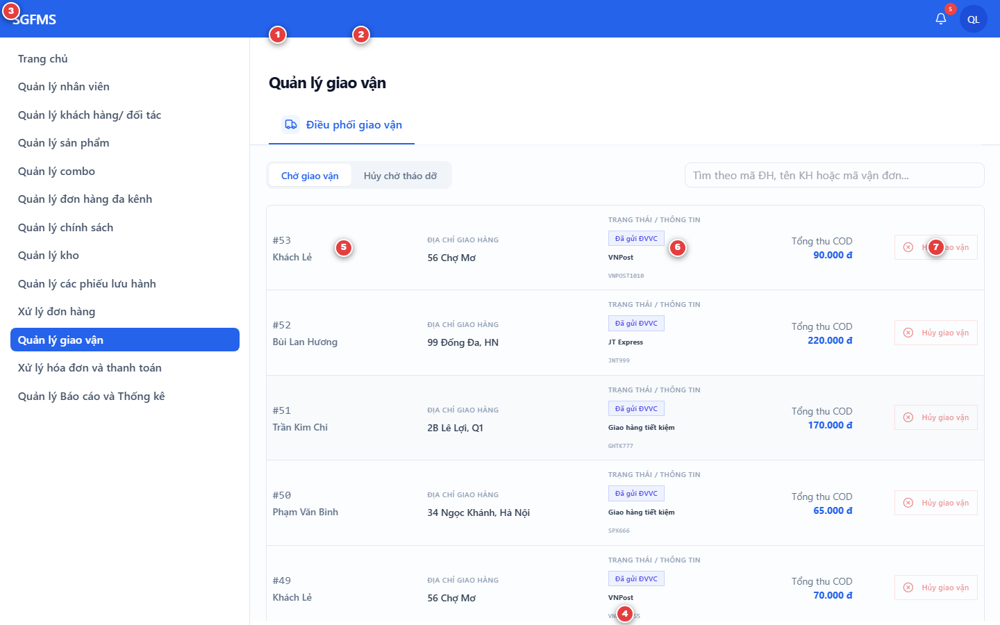

### Bảng mô tả thành phần

| STT | Tên thành phần | Kiểu | Chức năng |
|-----|----------------|------|-----------|
| 1 | tabReadyToShip | Tab | Tab "Chờ giao vận" — hiển thị đơn hàng đã đóng gói chờ bàn giao ĐVVC |
| 2 | tabUnpacking | Tab | Tab "Hủy chờ tháo dỡ" — hiển thị đơn đã hủy cần tháo dỡ kiện hàng. Có Badge đếm số lượng. Ẩn với Sales (RoleID=3) |
| 3 | txtSearchShipping | Input | Ô tìm kiếm theo mã đơn hàng, tên khách hàng hoặc mã vận đơn |
| 4 | tblShipments | Table | Bảng danh sách đơn hàng giao vận (Dữ liệu động). Hiển thị: Mã ĐH, Tên KH, Địa chỉ giao, Trạng thái/ĐVVC/Mã VĐ, Tổng tiền COD. Phân trang 20 bản ghi/trang |
| 5 | bdgShipmentStatus | Badge | Badge trạng thái: Đã đóng gói (blue), Đã gửi ĐVVC (indigo), Đã hủy đơn (red), Chờ tháo dỡ (red-small) |
| 6 | btnDispatch | Button | Nút "Đẩy đơn" với icon Truck (xanh). Mở DispatchDialog để bàn giao cho ĐVVC. Chỉ hiển thị với Thủ kho và đơn đã đóng gói |
| 7 | btnCancelShip | Button | Nút "Hủy giao vận" với icon XCircle (đỏ). Mở CancelReasonDialog. Chỉ hiển thị với Sales/Quản lý. Chỉ active khi đã có mã vận đơn và đã đóng gói |
| 8 | btnConfirmUnpack | Button | Nút "XÁC NHẬN THÁO DỠ" (xanh lá). Xác nhận hoàn tất tháo dỡ, reset shippingstatus=0. Chỉ hiển thị ở tab Hủy chờ tháo dỡ với Thủ kho |
| 9 | pagShipments | Pagination | Bộ điều hướng phân trang giao vận |
| 10 | mdlDispatchDialog | Modal | Dialog đẩy đơn — chọn ĐVVC và nhập mã vận đơn |
| 11 | mdlCancelReasonDialog | Modal | Dialog nhập lý do hủy giao vận |

---

## 16. RevenueReportPage – Báo cáo doanh thu

**Đường dẫn:** `/report-management` (tab doanh thu)  
**File:** `frontend/src/pages/16-report-management/RevenueReportPage.tsx`  
**Mô tả:** Màn hình báo cáo doanh thu theo khoảng thời gian. Hiển thị danh sách hóa đơn với thông tin chi tiết. Hỗ trợ xuất PDF.

### Hình ảnh minh họa

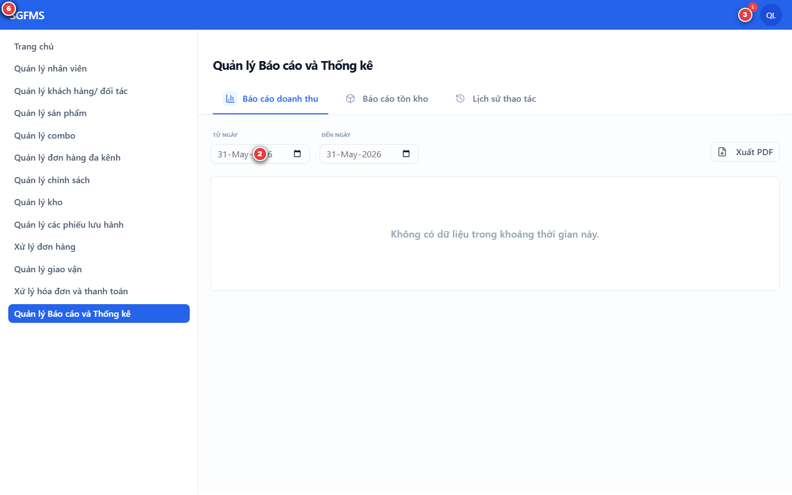

### Bảng mô tả thành phần

| STT | Tên thành phần | Kiểu | Chức năng |
|-----|----------------|------|-----------|
| 1 | dtpStartDateReport | DatePicker | Input type="date" chọn ngày bắt đầu khoảng báo cáo. Mặc định ngày đầu tháng hiện tại |
| 2 | dtpEndDateReport | DatePicker | Input type="date" chọn ngày kết thúc khoảng báo cáo. Mặc định ngày hiện tại |
| 3 | btnExportPdf | Button | Nút "Xuất PDF" với icon FileDown. Gọi API `downloadRevenuePdf(startDate, endDate)` để tải file báo cáo |
| 4 | tblRevenueReport | Table | Bảng danh sách hóa đơn trong khoảng thời gian (Dữ liệu động). Hiển thị: Mã HĐ, Ngày, ID Khách hàng, Kênh bán (badge), Tổng tiền |
| 5 | bdgSaleChannel | Badge | Badge kênh bán: "Tại quầy" (xanh dương), "Trực tuyến" (tím) |

---

## 17. InvoiceSearchPage – Tra cứu hóa đơn (Kế toán)

**Đường dẫn:** `/accounting-management` (tab tra cứu hóa đơn)  
**File:** `frontend/src/pages/19-accounting-management/InvoiceSearchPage.tsx`  
**Mô tả:** Màn hình tra cứu và in lại hóa đơn phục vụ bộ phận kế toán. Tương tự InvoiceManagementPage nhưng không có chức năng xác nhận thanh toán.

### Hình ảnh minh họa

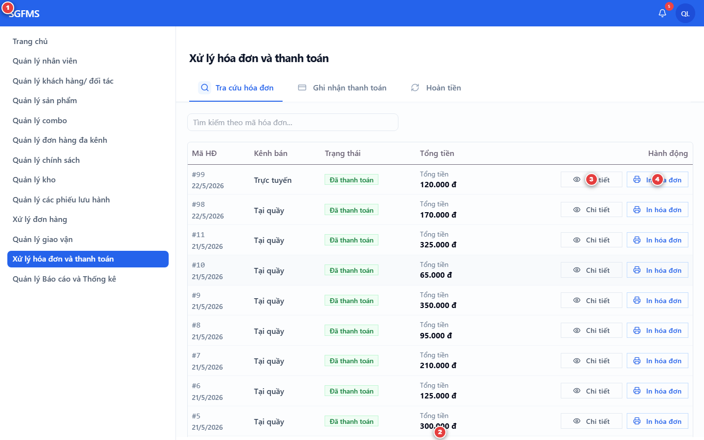

### Bảng mô tả thành phần

| STT | Tên thành phần | Kiểu | Chức năng |
|-----|----------------|------|-----------|
| 1 | txtSearchAccountingInvoice | Input | Ô tìm kiếm theo mã hóa đơn. Placeholder "Tìm kiếm theo mã hóa đơn..." |
| 2 | tblAccountingInvoices | Table | Bảng danh sách hóa đơn (Dữ liệu động). Có header hiển thị cột: Mã HĐ, Kênh bán, Trạng thái, Tổng tiền, Hành động. Phân trang 20 bản ghi/trang |
| 3 | bdgAccountingStatus | Badge | Badge trạng thái: Chờ thanh toán (amber), Đã thanh toán (green), Thanh toán 1 phần (blue) |
| 4 | btnViewDetailAccounting | Button | Nút "Chi tiết" với icon Eye — mở DetailInvoiceDialog |
| 5 | btnPrintAccounting | Button | Nút "In hóa đơn" với icon Printer — mở PrintInvoiceDialog |
| 6 | pagAccountingInvoices | Pagination | Bộ điều hướng phân trang hóa đơn kế toán |
| 7 | mdlDetailInvoiceAccounting | Modal | Dialog xem chi tiết hóa đơn |
| 8 | mdlPrintInvoiceAccounting | Modal | Dialog xem trước và in hóa đơn |

---

## PHẦN II – THÀNH PHẦN ẨN (DIALOG / MODAL)

> **Ghi chú:** Các Dialog/Modal dưới đây là thành phần ẩn chỉ xuất hiện khi người dùng tương tác (bấm nút Thêm mới, Chỉnh sửa, Chi tiết, v.v.). Tên thành phần được trích xuất trực tiếp từ mã nguồn JSX.

---

## NewEmpDialog – Thêm nhân viên mới

**Thuộc trang:** Quản lý nhân viên (`/emp-management`)  
**File:** `frontend/src/pages/2-emp-management/NewEmpDialog.tsx`  
**Kích hoạt bởi:** Nút `btnAddEmp` "Thêm nhân viên mới"

### Hình ảnh minh họa

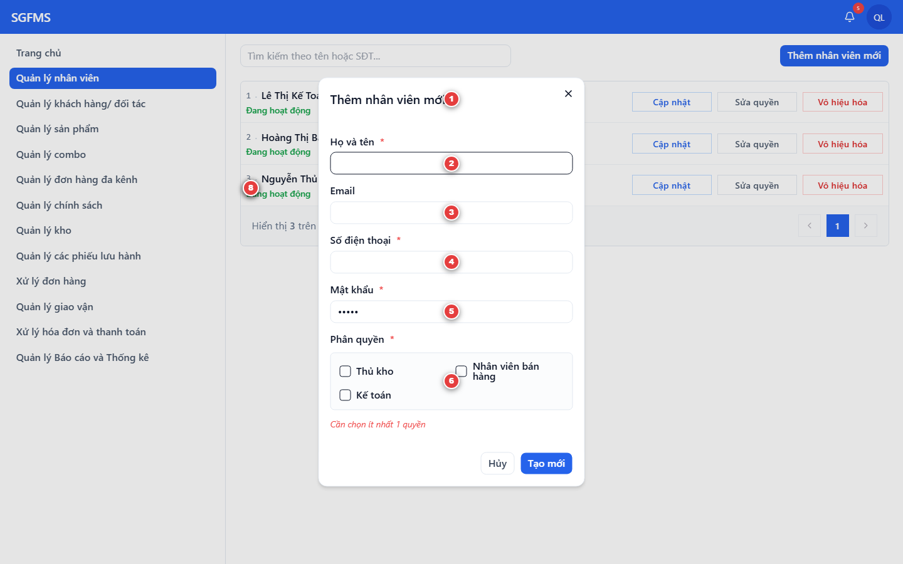

### Bảng mô tả thành phần

| STT | Tên thành phần | Kiểu | Chức năng |
|-----|----------------|------|-----------| 
| 1 | lblTitleNewEmp | Title | Hiển thị tiêu đề "Thêm nhân viên mới" |
| 2 | txtFullname | Input | Nhập họ và tên đầy đủ. Bắt buộc (*), không để trống (id="fullname") |
| 3 | txtEmail | Input | Nhập địa chỉ email nhân viên (tùy chọn) (id="email") |
| 4 | txtPhone | Input | Nhập SĐT — dùng làm username đăng nhập. Bắt buộc (*) (id="phone") |
| 5 | txtPassword | Input (password) | Nhập mật khẩu mặc định. Mặc định "12345". Bắt buộc (*) (id="password") |
| 6 | chkRoleGroup | Checkbox Group | 2 cột checkbox phân quyền (lọc RoleID≠1). Phải chọn ít nhất 1 |
| 7 | btnCancel | Button | Nút "Hủy" — đóng dialog, không lưu |
| 8 | btnCreate | Button | Nút "Tạo mới" — gọi `api.employees.create()` rồi `api.employeeRoles.create()` cho từng role |

> **Ghi chú:** Sau khi tạo, hệ thống tự gán `Status: 1`. Form reset sau khi lưu thành công.

---

## EditEmpDialog – Cập nhật thông tin nhân viên

**Thuộc trang:** Quản lý nhân viên; Thông tin cá nhân (`/profile`)  
**File:** `frontend/src/pages/2-emp-management/EditEmpDialog.tsx`  
**Kích hoạt bởi:** Nút `btnUpdateEmp` "Cập nhật"

### Hình ảnh minh họa

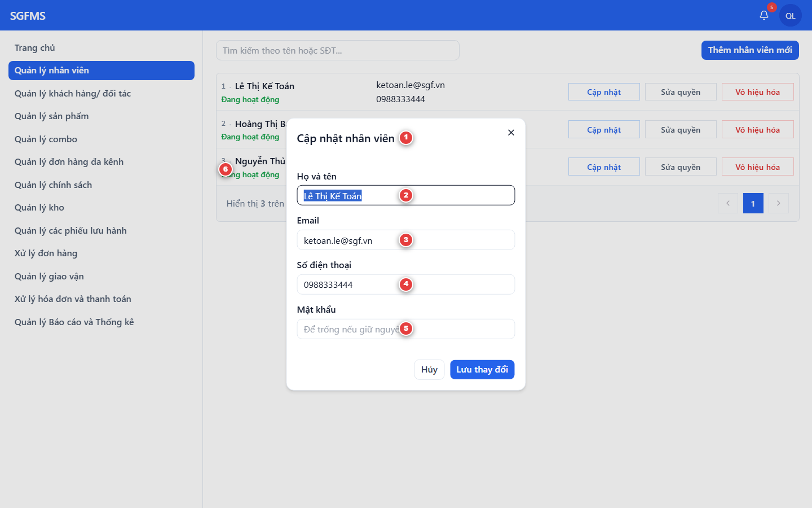

### Bảng mô tả thành phần

| STT | Tên thành phần | Kiểu | Chức năng |
|-----|----------------|------|-----------| 
| 1 | lblTitleEditEmp | Title | Hiển thị "Cập nhật nhân viên" |
| 2 | txtFullname | Input | Chỉnh sửa họ tên. Bắt buộc không để trống. Prefill từ `employee.Fullname` (id="fullname") |
| 3 | txtEmail | Input | Chỉnh sửa email. Prefill từ `employee.Email` (id="email") |
| 4 | txtPhone | Input | Chỉnh sửa SĐT. Prefill từ `employee.Phone` (id="phone") |
| 5 | txtPassword | Input (password) | Nhập mật khẩu mới. Placeholder "Để trống nếu giữ nguyên". **Chỉ hiển thị khi người dùng có RoleID=1** (id="password") |
| 6 | btnCancel | Button | Nút "Hủy" |
| 7 | btnSave | Button | Nút "Lưu thay đổi" — gọi `api.employees.update()` |

---

## EditRoleDialog – Cập nhật phân quyền nhân viên

**Thuộc trang:** Quản lý nhân viên  
**File:** `frontend/src/pages/2-emp-management/EditRoleDialog.tsx`  
**Kích hoạt bởi:** Nút `btnEditRole` "Sửa quyền"

### Hình ảnh minh họa

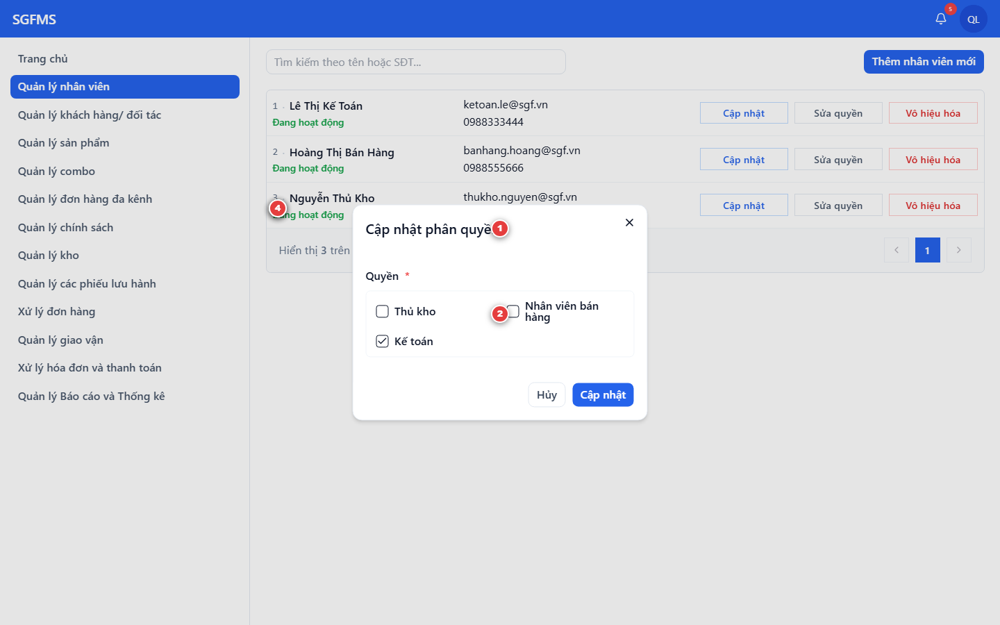

### Bảng mô tả thành phần

| STT | Tên thành phần | Kiểu | Chức năng |
|-----|----------------|------|-----------| 
| 1 | lblTitleEditRole | Title | Hiển thị "Cập nhật phân quyền" |
| 2 | chkRoleGroup | Checkbox Group | 2 cột checkbox các vai trò (trừ RoleID=1). Tích sẵn quyền hiện tại (Dữ liệu động từ `api.employeeRoles.list()`) |
| 3 | lblRoleError | Label | Cảnh báo "Cần chọn ít nhất 1 quyền" — hiện khi không có checkbox nào được tick |
| 4 | btnCancel | Button | Nút "Hủy" |
| 5 | btnUpdate | Button | Nút "Cập nhật" — thêm quyền mới (toAdd) và xóa quyền cũ (toDelete) qua API. Hiển thị "Đang cập nhật..." |

> **Ghi chú:** Hệ thống so sánh quyền chọn với quyền hiện tại — chỉ gọi API cho các thay đổi thực sự.

---

## NewCompDialog – Thêm đối tác vận chuyển mới

**Thuộc trang:** Quản lý đối tác vận chuyển (`/customer-partner-management?tab=partners`)  
**File:** `frontend/src/pages/3-comp-management/NewCompDialog.tsx`  
**Kích hoạt bởi:** Nút `btnAddComp` "Thêm đối tác mới"

### Hình ảnh minh họa

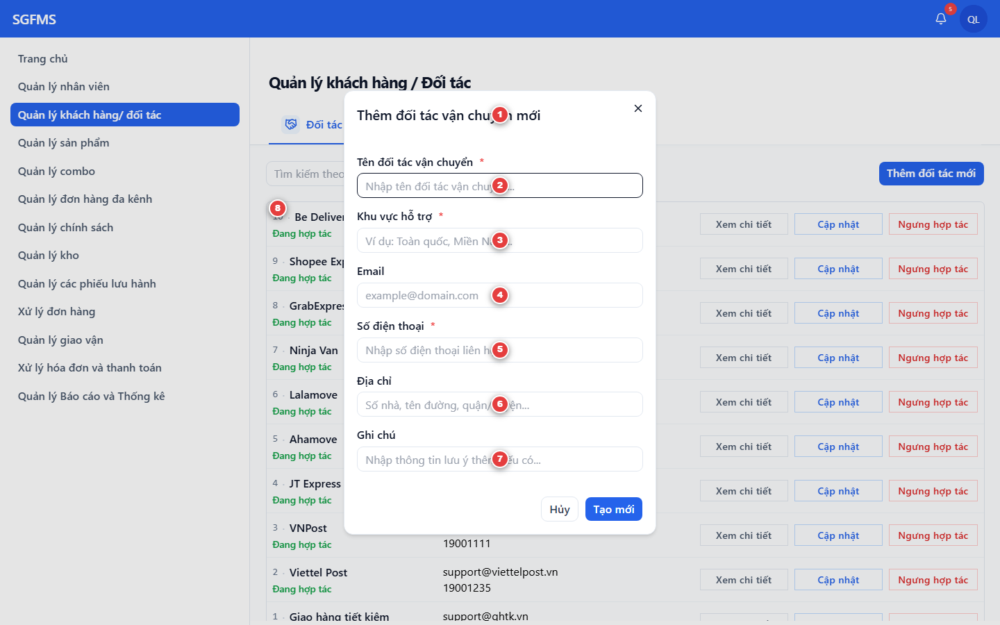

### Bảng mô tả thành phần

| STT | Tên thành phần | Kiểu | Chức năng |
|-----|----------------|------|-----------| 
| 1 | lblTitleNewComp | Title | "Thêm đối tác vận chuyển mới" |
| 2 | txtShipCompanyName | Input | Tên đối tác. Bắt buộc (*). Placeholder "Nhập tên đối tác vận chuyển..." (id="new-shipCompanyName") |
| 3 | txtSupportedRegion | Input | Khu vực hỗ trợ. Bắt buộc (*). Placeholder "Ví dụ: Toàn quốc, Miền Nam..." (id="new-supportedRegion") |
| 4 | txtEmail | Input (email) | Email liên hệ (tùy chọn). Placeholder "example@domain.com" (id="new-email") |
| 5 | txtPhone | Input | SĐT liên hệ. Bắt buộc (*) (id="new-phone") |
| 6 | txtAddress | Input | Địa chỉ trụ sở (tùy chọn) (id="new-address") |
| 7 | txtNotes | Input | Ghi chú bổ sung (tùy chọn) (id="new-notes") |
| 8 | btnCancel | Button | Nút "Hủy" |
| 9 | btnCreate | Button | Nút "Tạo mới" — gọi `api.shipCompanies.create()` với `Status: 1` |

---

## DetailCompDialog – Chi tiết đối tác vận chuyển

**Thuộc trang:** Quản lý đối tác vận chuyển  
**File:** `frontend/src/pages/3-comp-management/DetailCompDialog.tsx`  
**Kích hoạt bởi:** Nút `btnViewDetail` "Xem chi tiết"

### Hình ảnh minh họa

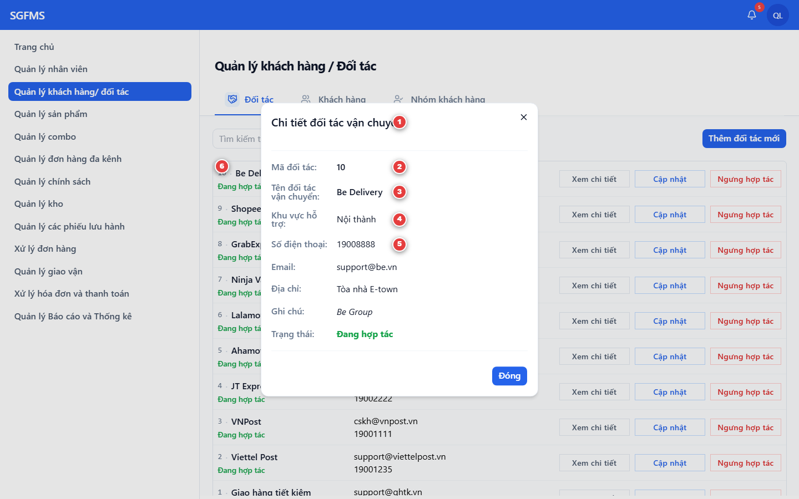

### Bảng mô tả thành phần

| STT | Tên thành phần | Kiểu | Chức năng |
|-----|----------------|------|-----------| 
| 1 | lblTitleDetail | Title | "Chi tiết đối tác vận chuyển" |
| 2 | lblShipCompanyID | Label | Mã đối tác (`comp.ShipCompanyID`) — Dữ liệu động |
| 3 | lblShipCompanyName | Label | Tên đối tác (`comp.ShipCompanyName`) — Dữ liệu động |
| 4 | lblSupportedRegion | Label | Khu vực hỗ trợ (`comp.SupportedRegion`) |
| 5 | lblPhone | Label | Số điện thoại (`comp.Phone`) |
| 6 | lblEmail | Label | Email (`comp.Email`) |
| 7 | lblAddress | Label | Địa chỉ (`comp.Address`) |
| 8 | lblNotes | Label | Ghi chú. Hiện "Không có ghi chú" nếu trống |
| 9 | lblStatus | Label | Trạng thái: "Đang hợp tác" (xanh) / "Ngưng hợp tác" (đỏ) |
| 10 | btnClose | Button | Nút "Đóng" |

---

## NewCustomerDialog – Thêm khách hàng mới

**Thuộc trang:** Quản lý khách hàng (`/customer-partner-management?tab=customers`)  
**File:** `frontend/src/pages/4-customer-management-page/NewCustomerDialog.tsx`  
**Kích hoạt bởi:** Nút `btnAddCustomer` "Thêm khách hàng mới"

### Hình ảnh minh họa

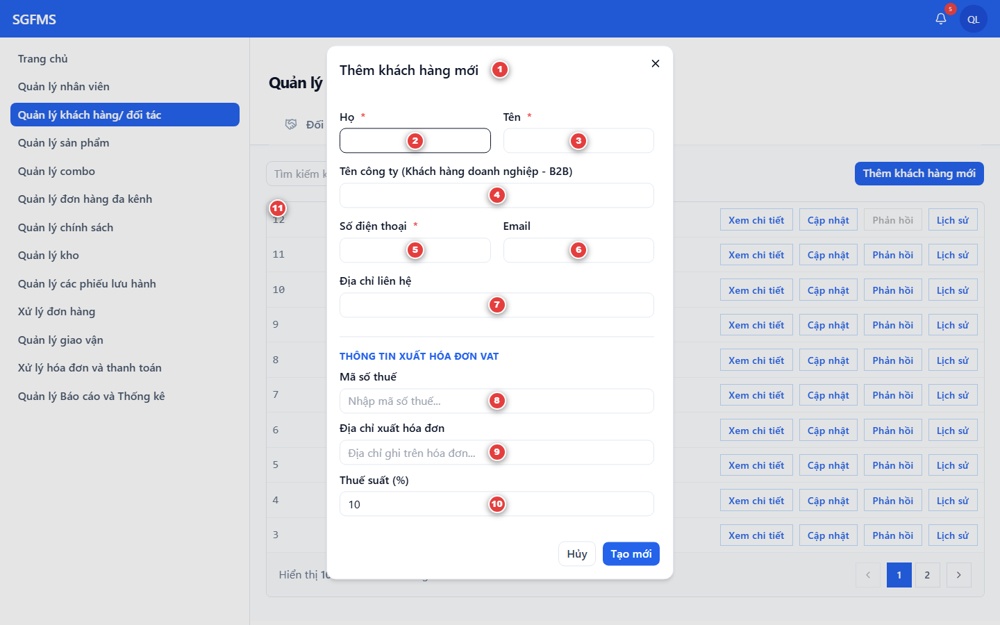

### Bảng mô tả thành phần

| STT | Tên thành phần | Kiểu | Chức năng |
|-----|----------------|------|-----------| 
| 1 | lblTitleNewCustomer | Title | "Thêm khách hàng mới" |
| 2 | txtFirstName | Input | Nhập họ của khách hàng. Bắt buộc (*) (id="FirstName") |
| 3 | txtLastName | Input | Nhập tên riêng. Bắt buộc (*) (id="LastName") |
| 4 | txtCompanyName | Input | Tên công ty (dành cho KH B2B, tùy chọn) (id="CompanyName") |
| 5 | txtPhone | Input | SĐT liên hệ. Bắt buộc (*) (id="Phone") |
| 6 | txtEmail | Input | Email khách hàng (tùy chọn) (id="Email") |
| 7 | txtAddress | Input | Địa chỉ giao hàng chính (tùy chọn) (id="Address") |
| 8 | txtTaxCode | Input | Mã số thuế dành cho xuất hóa đơn VAT (tùy chọn) (id="TaxCode") |
| 9 | txtInvoiceAddress | Input | Địa chỉ ghi trên hóa đơn VAT (tùy chọn) (id="InvoiceAddress") |
| 10 | txtTaxRate | Input (number) | Thuế suất %. Mặc định 10 (id="TaxRate") |
| 11 | btnCancel | Button | Nút "Hủy" |
| 12 | btnCreate | Button | Nút "Tạo mới" — gọi `api.customers.create()` |

---

## OrderHistoryDialog – Lịch sử đơn hàng khách hàng

**Thuộc trang:** Quản lý khách hàng  
**File:** `frontend/src/pages/4-customer-management-page/OrderHistoryDialog.tsx`  
**Kích hoạt bởi:** Nút `btnOrderHistory` "Lịch sử"

### Hình ảnh minh họa

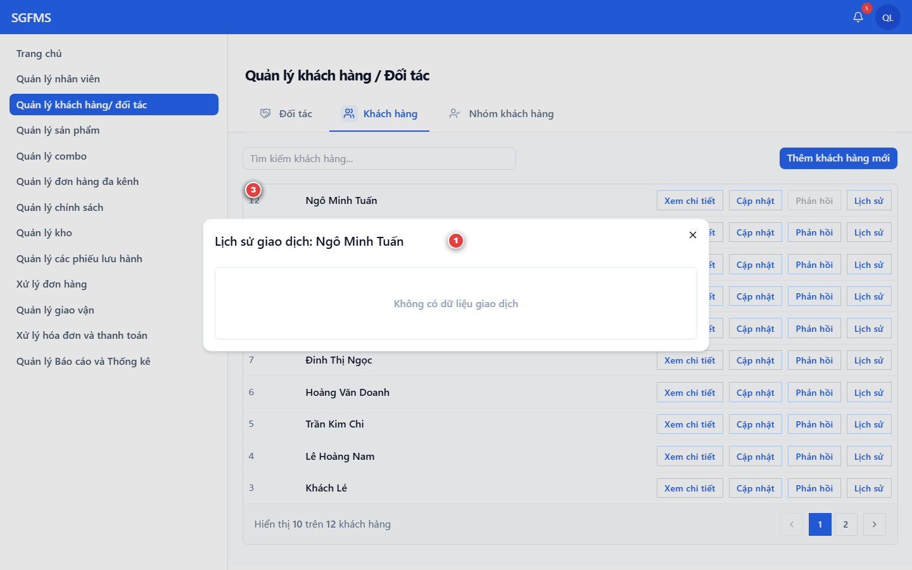

### Bảng mô tả thành phần

| STT | Tên thành phần | Kiểu | Chức năng |
|-----|----------------|------|-----------| 
| 1 | lblTitleOrderHistory | Title | "Lịch sử đơn hàng – [Tên khách hàng]" |
| 2 | tblOrderHistory | Table | Danh sách đơn hàng của khách: Mã ĐH, Ngày tạo, Trạng thái, Tổng tiền (Dữ liệu động) |
| 3 | bdgOrderStatus | Badge | Badge trạng thái theo màu sắc |
| 4 | lblTotalSpent | Label | Tổng chi tiêu tích lũy (`totalaccumulatedspent`) |
| 5 | btnClose | Button | Nút "Đóng" |

---

## NewProductDialog – Tạo mới sản phẩm

**Thuộc trang:** Quản lý sản phẩm (`/product-management?tab=products`)  
**File:** `frontend/src/pages/6.1-product-management/NewProductDialog.tsx`  
**Kích hoạt bởi:** Nút `btnAddProduct` "Thêm sản phẩm mới"

### Hình ảnh minh họa

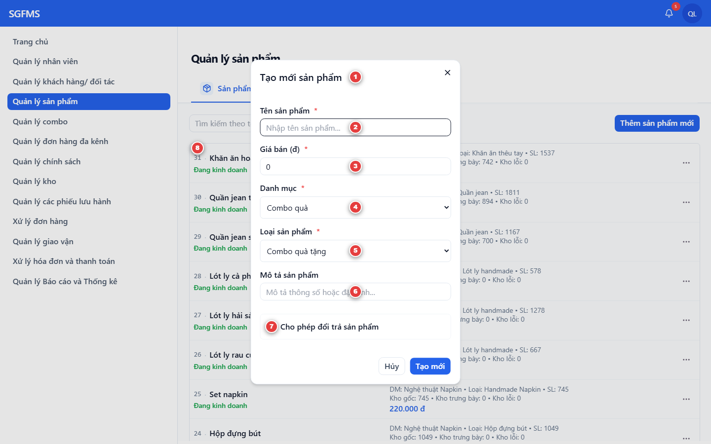

### Bảng mô tả thành phần

| STT | Tên thành phần | Kiểu | Chức năng |
|-----|----------------|------|-----------| 
| 1 | lblTitleNewProduct | Title | "Tạo mới sản phẩm" |
| 2 | txtProductName | Input | Tên sản phẩm. Bắt buộc (*) (id="new-productName") |
| 3 | txtProductPrice | Input (number) | Giá bán (đ). Bắt buộc (*), phải > 0 (id="new-productPrice") |
| 4 | cboCategoryId | Select | Chọn danh mục. Bắt buộc (*). Dữ liệu động từ `api.categories.list()` (id="new-categoryId") |
| 5 | cboProductTypeId | Select | Chọn loại sản phẩm. Bắt buộc (*). Dữ liệu động từ `api.productTypes.list()` (id="new-productTypeId") |
| 6 | txtDetail | Input | Mô tả/thông số kỹ thuật (tùy chọn) (id="new-detail") |
| 7 | chkAllowReturn | Checkbox | "Cho phép đổi trả sản phẩm". Mặc định checked=true (id="new-allowReturn") |
| 8 | btnCancel | Button | Nút "Hủy" |
| 9 | btnCreate | Button | Nút "Tạo mới" — gọi `api.products.create()` với `ProductStatus: 1` |

---

## NewOrderDialog – Tạo đơn hàng

**Thuộc trang:** Quản lý đơn hàng (`/multichannel-order-management`)  
**File:** `frontend/src/pages/8.2-order-management-page/NewOrderDialog.tsx`  
**Kích hoạt bởi:** Nút `btnAddOrder` "Tạo đơn mới"

### Hình ảnh minh họa

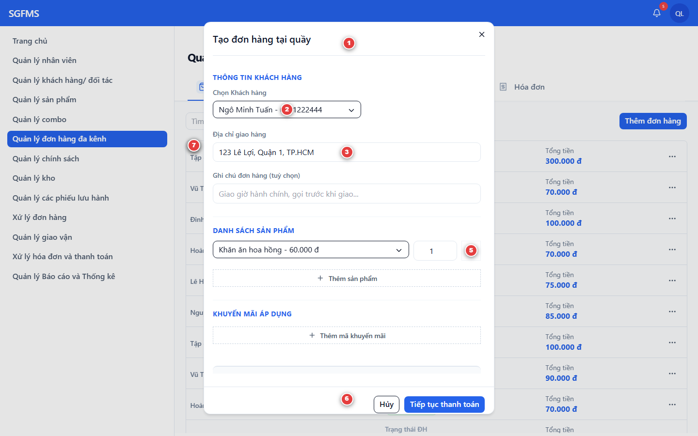

### Bảng mô tả thành phần

| STT | Tên thành phần | Kiểu | Chức năng |
|-----|----------------|------|-----------| 
| 1 | lblTitleNewOrder | Title | "Tạo đơn hàng tại quầy" hoặc "Tạo đơn hàng trực tuyến" — theo `saleChannelCode` |
| 2 | cboCustomer | Select (NativeSelect) | Chọn khách hàng. Dữ liệu động. Khi chọn tự fill địa chỉ và thông tin VAT |
| 3 | txtShippingAddress | Input | Địa chỉ giao hàng. Tự fill từ KH được chọn, có thể sửa |
| 4 | txtShipmentNote | Input | Ghi chú đơn hàng (tùy chọn). Placeholder "Giao giờ hành chính, gọi trước khi giao..." |
| 5 | chkWantVAT | Checkbox | "Tôi muốn xuất hóa đơn VAT". **Chỉ hiển thị kênh online**. Khi tick mở nhóm trường VAT (tên, địa chỉ, MST người mua) |
| 6 | lstProductRows | Dynamic List | Mỗi dòng: Select sản phẩm + Input số lượng + nút Xóa. Nút "Thêm sản phẩm" thêm dòng mới |
| 7 | lstPromoRows | Dynamic List | Mỗi dòng: Select khuyến mãi + nút Xóa. Nút "Thêm mã khuyến mãi" thêm dòng |
| 8 | cboShipCompany | Select | Chọn ĐVVC. **Chỉ hiển thị kênh online** |
| 9 | txtShippingFee | Input (number) | Phí vận chuyển (đ). Mặc định 30,000. **Chỉ hiển thị kênh online** |
| 10 | panelSummary | Panel | Tạm tính / Thuế 10% / Giảm giá / Phí ship / **TỔNG CỘNG** (tính realtime) |
| 11 | panelPayment | Panel | **Bước 2 (tại quầy):** Nhập số tiền khách đưa, tính tiền thừa, nút tắt nhanh 100K-1M |
| 12 | btnCancel | Button | Nút "Hủy" |
| 13 | btnSubmit | Button | "Tạo đơn" (online) / "Thanh toán" (tại quầy B1) / "Xác nhận & Thanh toán" (tại quầy B2) |

---

## NewDiscountDialog – Tạo chương trình khuyến mãi

**Thuộc trang:** Quản lý chính sách (`/policy-management?tab=promotions`)  
**File:** `frontend/src/pages/7.2-discount-management-page/NewDiscountDialog.tsx`  
**Kích hoạt bởi:** Nút "Thêm mới" tab Khuyến mãi

### Hình ảnh minh họa

### Bảng mô tả thành phần

| STT | Tên thành phần | Kiểu | Chức năng |
|-----|----------------|------|-----------| 
| 1 | lblTitleNewDiscount | Title | "Tạo mới chương trình khuyến mãi" |
| 2 | txtDiscountName | Input | Tên chương trình khuyến mãi. Bắt buộc (*) (id="new-name") |
| 3 | cboAppliedProduct | Select (NativeSelect) | Sản phẩm áp dụng. Bắt buộc (*). Dữ liệu động từ `api.products.list()` (id="new-product") |
| 4 | txtValue | Input (number) | Mức giảm giá (đ). Bắt buộc (*), phải > 0 (id="new-value") |
| 5 | cboCustomerType | Select (NativeSelect) | Đối tượng KH áp dụng. Dữ liệu động từ `api.customerTypes.list()` (id="new-cust-type") |
| 6 | dtpStartDate | Input (date) | Ngày bắt đầu khuyến mãi. Bắt buộc (*) (id="new-start-date") |
| 7 | dtpExpiryDate | Input (date) | Ngày hết hạn khuyến mãi. Bắt buộc (*). Validate: startDate ≤ expiryDate (id="new-expiry-date") |
| 8 | cboStatus | Select (NativeSelect) | Trạng thái: Chờ chạy (0) / Đang chạy (1) / Tạm dừng (2) (id="new-status") |
| 9 | txtDetail | Input | Chi tiết/điều kiện áp dụng (tùy chọn) (id="new-detail") |
| 10 | btnCancel | Button | Nút "Hủy" |
| 11 | btnCreate | Button | Nút "Tạo mới" — gọi `api.discounts.create()` |

---

## NewPolicyDialog – Tạo chính sách đổi trả

**Thuộc trang:** Quản lý chính sách (`/policy-management?tab=policies`)  
**File:** `frontend/src/pages/10-policy-management-page/NewPolicyDialog.tsx`  
**Kích hoạt bởi:** Nút "Thêm mới" tab Chính sách đổi trả

### Hình ảnh minh họa

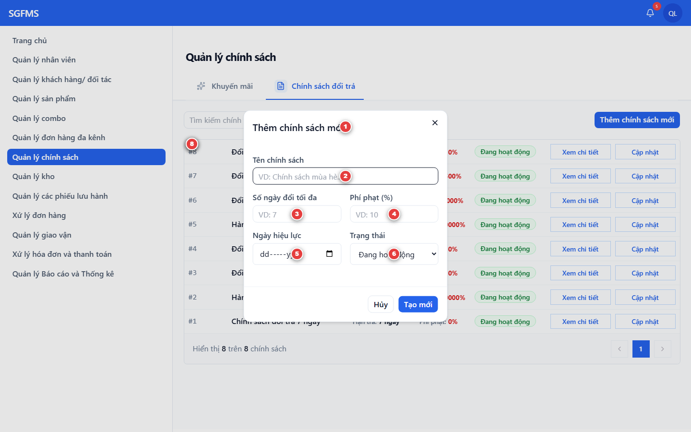

### Bảng mô tả thành phần

| STT | Tên thành phần | Kiểu | Chức năng |
|-----|----------------|------|-----------| 
| 1 | lblTitleNewPolicy | Title | "Thêm chính sách mới" |
| 2 | txtPolicyName | Input | Tên chính sách. Bắt buộc (*). Placeholder "VD: Chính sách mùa hè..." (id="PolicyName") |
| 3 | txtMaxReturnDays | Input (number) | Số ngày đổi trả tối đa. Mặc định 7 (id="MaxReturnDays") |
| 4 | txtPenaltyFeeRate | Input (number) | Phí phạt (%). Mặc định 0. Hệ thống tự chia 100 khi lưu (id="PenaltyFeeRate") |
| 5 | dtpEffectiveDate | Input (date) | Ngày có hiệu lực. Mặc định ngày hiện tại (id="EffectiveDate") |
| 6 | cboIsActive | Select | Trạng thái: Đang hoạt động (1) / Tạm dừng (0) (id="IsActive") |
| 7 | btnCancel | Button | Nút "Hủy" |
| 8 | btnCreate | Button | Nút "Tạo mới" — gọi `api.returnPolicies.create()` |

---

## NewWarehouseDialog – Thêm kho hàng mới

**Thuộc trang:** Quản lý kho hàng (`/warehouse-management`)  
**File:** `frontend/src/pages/11.1-warehouse-management-page/NewWarehouseDialog.tsx`  
**Kích hoạt bởi:** Nút `btnAddWarehouse` "Thêm kho hàng mới"

### Hình ảnh minh họa

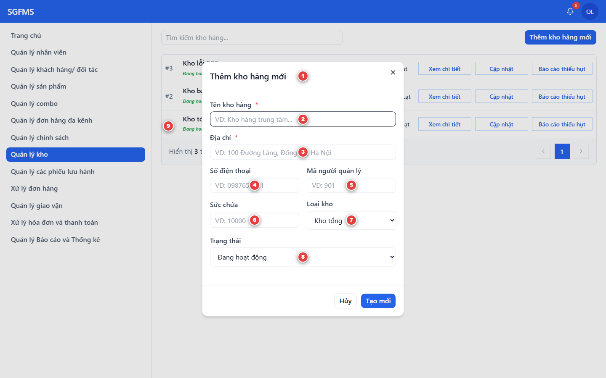

### Bảng mô tả thành phần

| STT | Tên thành phần | Kiểu | Chức năng |
|-----|----------------|------|-----------| 
| 1 | lblTitleNewWarehouse | Title | "Thêm kho hàng mới" |
| 2 | txtWareHouseName | Input | Tên kho. Bắt buộc (*). Placeholder "VD: Kho hàng trung tâm..." (id="WareHouseName") |
| 3 | txtAddress | Input | Địa chỉ kho. Bắt buộc (*) (id="Address") |
| 4 | txtContactNumber | Input | SĐT liên hệ kho (tùy chọn) (id="ContactNumber") |
| 5 | txtManagerID | Input (number) | Mã nhân viên quản lý kho (tùy chọn) (id="ManagerID") |
| 6 | txtCapacity | Input (number) | Sức chứa tối đa (tùy chọn) (id="Capacity") |
| 7 | cboWarehouseType | Select | Loại kho: Kho tổng (1) / Kho phân phối (2) (id="WarehouseType") |
| 8 | cboStatus | Select | Trạng thái: Đang hoạt động (1) / Tạm dừng (0) (id="Status") |
| 9 | btnCancel | Button | Nút "Hủy" |
| 10 | btnCreate | Button | Nút "Tạo mới" — gọi `api.warehouses.create()` |

---

## NewRequestDialog – Tạo yêu cầu bổ sung

**Thuộc trang:** Quản lý phiếu lưu hành (`/circulating-slips-management?tab=replenishment-requests`)  
**File:** `frontend/src/pages/11.2-request-management-page/NewRequestDialog.tsx`  
**Kích hoạt bởi:** Nút `btnCreateRequest` "Tạo yêu cầu mới"

### Hình ảnh minh họa

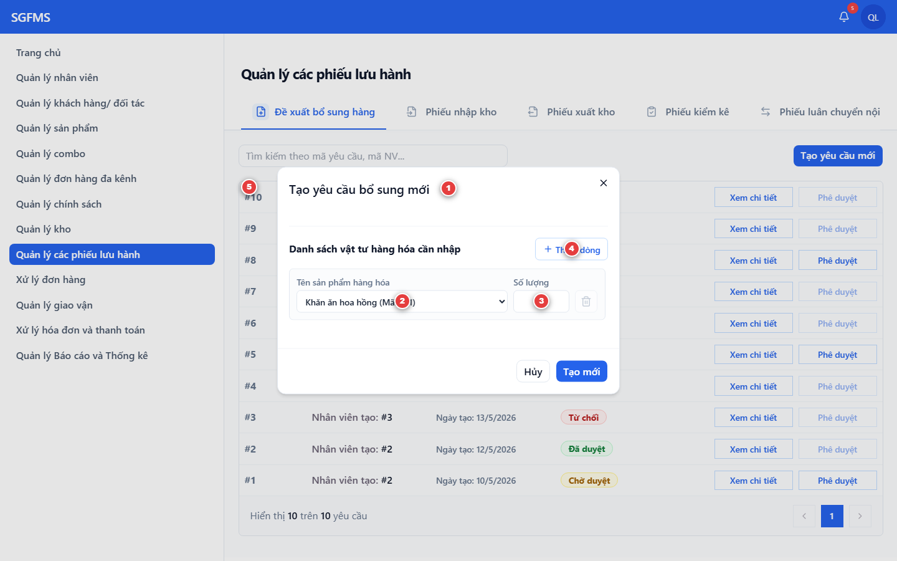

### Bảng mô tả thành phần

| STT | Tên thành phần | Kiểu | Chức năng |
|-----|----------------|------|-----------| 
| 1 | lblTitleNewRequest | Title | "Tạo yêu cầu bổ sung mới" |
| 2 | lblListHeader | Label | "Danh sách vật tư hàng hóa cần nhập" |
| 3 | btnAddLine | Button | Nút "Thêm dòng" (Plus) — thêm dòng sản phẩm mới |
| 4 | cboProductID | Select | (Mỗi dòng) Chọn sản phẩm. Dữ liệu động từ `api.products.list()` |
| 5 | txtQuantity | Input (number) | (Mỗi dòng) Số lượng cần bổ sung. Tối thiểu 1 |
| 6 | btnRemoveLine | Button | (Mỗi dòng) Nút Trash2 — xóa dòng. Bị disable khi chỉ còn 1 dòng |
| 7 | btnCancel | Button | Nút "Hủy" |
| 8 | btnCreate | Button | Nút "Tạo mới" — gọi `api.requestForms.create()` + `api.requestDetails.create()` mỗi dòng. Gán `Status: "0"` (Chờ duyệt) |

> **Ghi chú:** Sau khi tạo, yêu cầu cần Quản lý (RoleID=1) phê duyệt mới có thể tạo phiếu nhập kho.

---

## NewImportReceiptDialog – Tạo phiếu nhập kho

**Thuộc trang:** Quản lý phiếu lưu hành (`/circulating-slips-management?tab=import-receipts`)  
**File:** `frontend/src/pages/12.1-importreceipt-management-page/NewImportReceiptDialog.tsx`  
**Kích hoạt bởi:** Nút `btnCreateImportReceipt` "Tạo phiếu nhập kho"

### Hình ảnh minh họa

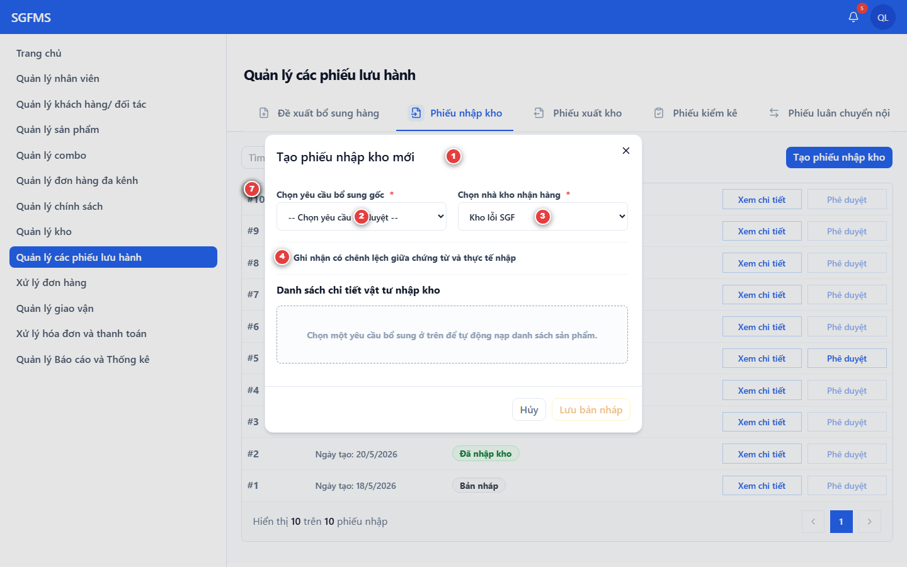

### Bảng mô tả thành phần

| STT | Tên thành phần | Kiểu | Chức năng |
|-----|----------------|------|-----------| 
| 1 | lblTitleNewImport | Title | "Tạo phiếu nhập kho mới" |
| 2 | cboSelectedRequestId | Select | Chọn yêu cầu bổ sung đã duyệt. Bắt buộc (*). Dữ liệu động — chỉ yêu cầu Status="1"/"Đã duyệt" (id="selectedRequestId") |
| 3 | cboWarehouseId | Select | Chọn kho nhận hàng. Bắt buộc (*). Dữ liệu động — chỉ kho Status=1 (id="warehouseSelect") |
| 4 | chkHasDiscrepancy | Checkbox | "Ghi nhận có chênh lệch giữa chứng từ và thực tế". Tự tick khi phát hiện số thực ≠ số yêu cầu (id="hasDiscrepancy") |
| 5 | txtDiscrepancyReason | Textarea | Lý do chênh lệch. **Điều kiện:** chkHasDiscrepancy=true. Placeholder "Ghi chi tiết lý do lệch..." |
| 6 | txtDiscrepancyImageURL | Input | URL ảnh đối chiếu. **Điều kiện:** chkHasDiscrepancy=true |
| 7 | tblProductItems | Dynamic Table | Danh sách chi tiết: Tên SP, Mã SP, Số lượng yêu cầu (readonly), Số lượng thực nhập (editable). Dòng lệch tô đỏ nhạt. Tự nạp khi chọn yêu cầu |
| 8 | btnCancel | Button | Nút "Hủy" |
| 9 | btnDraft | Button | Nút "Lưu bản nháp" (amber) — lưu với `Status: "Chờ duyệt"`, không tăng tồn kho |
| 10 | btnComplete | Button | Nút "Hoàn thành" — lưu phiếu VÀ cộng `ActualQuantity` vào `DetailInventory`. Chỉ hiện khi items.length > 0 |

---

## DispatchDialog – Điều phối giao vận

**Thuộc trang:** Quản lý giao vận (`/shipping-management`)  
**File:** `frontend/src/pages/17-shipping-management/DispatchDialog.tsx`  
**Kích hoạt bởi:** Nút `btnDispatch` "Đẩy đơn" (chỉ Thủ kho, đơn đã đóng gói)

### Hình ảnh minh họa

### Bảng mô tả thành phần

| STT | Tên thành phần | Kiểu | Chức năng |
|-----|----------------|------|-----------| 
| 1 | lblTitleDispatch | Title | "Điều phối giao vận ĐH #[ID]" màu xanh. Kèm mã đơn hàng (Dữ liệu động) |
| 2 | cboShipCompany | Select (NativeSelect) | Chọn ĐVVC. Bắt buộc (*). Chỉ hiện ĐVVC Status=1. Option mặc định "-- Chọn ĐVVC --" |
| 3 | lblNote | Label | "Hệ thống sẽ tự động gửi thông tin và nhận mã vận đơn từ đối tác." |
| 4 | btnCancel | Button | Nút "Hủy" |
| 5 | btnConfirmDispatch | Button | Nút "Xác nhận đẩy đơn" — gọi `api.shipping.assignShip(orderId, companyId)`. Disable khi chưa chọn ĐVVC |

---

## PrintInvoiceDialog – In hóa đơn

**Thuộc trang:** Quản lý hóa đơn; Tra cứu kế toán; Tạo đơn tại quầy  
**File:** `frontend/src/pages/8.1-invoice-management-page/PrintInvoiceDialog.tsx`  
**Kích hoạt bởi:** Nút `btnPrintInvoice` "In hóa đơn"

### Hình ảnh minh họa

### Bảng mô tả thành phần

| STT | Tên thành phần | Kiểu | Chức năng |
|-----|----------------|------|-----------| 
| 1 | lblTitlePrint | Title | "In hóa đơn #[InvoiceID]" |
| 2 | lblInvoiceInfo | Label Group | Thông tin hóa đơn: Ngày lập, Kênh bán, Trạng thái, Tên/địa chỉ/MST người mua (Dữ liệu động) |
| 3 | tblInvoiceDetail | Table | Danh sách sản phẩm: STT, Tên SP, SL, Đơn giá, Thành tiền. Dữ liệu động từ `api.invoiceDetails` |
| 4 | panelSummary | Panel | Tạm tính / Thuế (`TaxAmount`) / Tổng cộng (`FinalAmount`) — Dữ liệu động |
| 5 | btnPrint | Button | Nút "In hóa đơn" — gọi `window.print()` chỉ in vùng hóa đơn |
| 6 | btnClose | Button | Nút "Đóng" |
## EditCompDialog – Chỉnh sửa đối tác vận chuyển

**Thuộc trang:** Quản lý đối tác vận chuyển  
**File:** `frontend/src/pages/3-comp-management/EditCompDialog.tsx`  
**Kích hoạt bởi:** Nút `btnUpdateComp` "Cập nhật"

### Hình ảnh minh họa

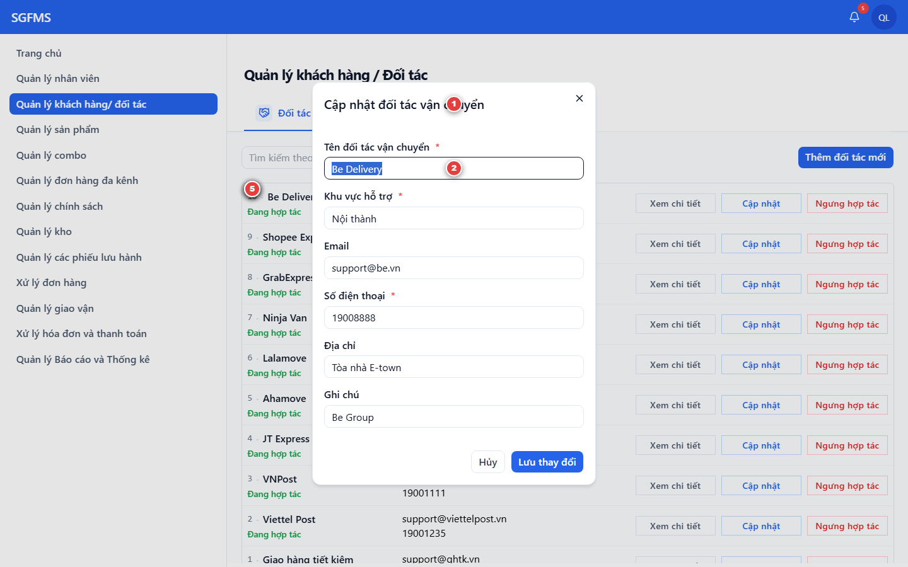

### Bảng mô tả thành phần

| STT | Tên thành phần | Kiểu | Chức năng |
|-----|----------------|------|-----------| 
| 1 | lblTitleEditComp | Title | "Cập nhật đối tác vận chuyển" |
| 2 | txtShipCompanyName | Input | Tên đối tác. Prefill từ dữ liệu hiện tại. Bắt buộc (*) |
| 3 | txtSupportedRegion | Input | Khu vực hỗ trợ. Prefill từ dữ liệu hiện tại |
| 4 | txtEmail | Input | Email liên hệ. Prefill từ dữ liệu hiện tại |
| 5 | txtPhone | Input | SĐT liên hệ. Prefill từ dữ liệu hiện tại |
| 6 | txtAddress | Input | Địa chỉ. Prefill từ dữ liệu hiện tại |
| 7 | txtNotes | Input | Ghi chú. Prefill từ dữ liệu hiện tại |
| 8 | btnCancel | Button | Nút "Hủy" |
| 9 | btnSave | Button | Nút "Lưu thay đổi" — gọi `api.shipCompanies.update()` |

---

## EditCustomerDialog – Chỉnh sửa thông tin khách hàng

**Thuộc trang:** Quản lý khách hàng  
**File:** `frontend/src/pages/4-customer-management-page/EditCustomerDialog.tsx`  
**Kích hoạt bởi:** Nút `btnUpdateCustomer` "Cập nhật"

### Hình ảnh minh họa

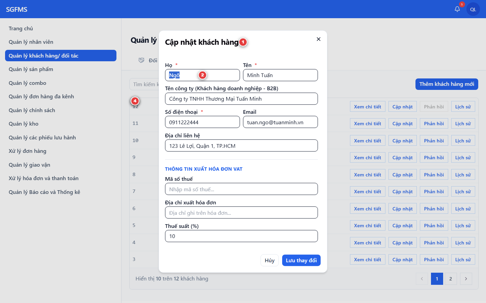

### Bảng mô tả thành phần

| STT | Tên thành phần | Kiểu | Chức năng |
|-----|----------------|------|-----------| 
| 1 | lblTitleEditCustomer | Title | "Cập nhật thông tin khách hàng" |
| 2 | txtFirstName | Input | Chỉnh sửa họ. Prefill từ `customer.FirstName` |
| 3 | txtLastName | Input | Chỉnh sửa tên. Prefill từ `customer.LastName` |
| 4 | txtCompanyName | Input | Chỉnh sửa tên công ty (B2B) |
| 5 | txtPhone | Input | Chỉnh sửa SĐT. Prefill từ `customer.Phone` |
| 6 | txtEmail | Input | Chỉnh sửa email |
| 7 | txtAddress | Input | Chỉnh sửa địa chỉ giao hàng |
| 8 | txtTaxCode | Input | Chỉnh sửa mã số thuế |
| 9 | txtInvoiceAddress | Input | Chỉnh sửa địa chỉ hóa đơn VAT |
| 10 | txtTaxRate | Input (number) | Chỉnh sửa thuế suất |
| 11 | btnCancel | Button | Nút "Hủy" |
| 12 | btnSave | Button | Nút "Lưu thay đổi" — gọi `api.customers.update()` |

---

## FeedbackDialog – Ghi nhận phản hồi khách hàng

**Thuộc trang:** Quản lý khách hàng  
**File:** `frontend/src/pages/4-customer-management-page/FeedbackDialog.tsx`  
**Kích hoạt bởi:** Nút `btnFeedback` "Phản hồi" — chỉ active khi KH có đơn giao thành công

### Hình ảnh minh họa

### Bảng mô tả thành phần

| STT | Tên thành phần | Kiểu | Chức năng |
|-----|----------------|------|-----------| 
| 1 | lblTitleFeedback | Title | "Ghi nhận phản hồi khách hàng – [Tên KH]" |
| 2 | lblRatingStars | Rating | Chọn đánh giá sao (1-5). Hiển thị icon Star, click chọn mức sao |
| 3 | txtComment | Textarea/Input | Nhập nội dung phản hồi/nhận xét của khách hàng |
| 4 | btnCancel | Button | Nút "Hủy" |
| 5 | btnSave | Button | Nút "Lưu phản hồi" — gọi API lưu feedback |

> **Điều kiện render:** Nút "Phản hồi" bị vô hiệu hóa (opacity-40) nếu khách hàng không có đơn giao thành công (shippingstatus=3) hoặc hóa đơn tại quầy đã thanh toán.

---

## NewCatDialog – Thêm danh mục sản phẩm mới

**Thuộc trang:** Quản lý danh mục (`/product-management?tab=categories`)  
**File:** `frontend/src/pages/5.1-category-management-page/NewCatDialog.tsx`  
**Kích hoạt bởi:** Nút `btnAddCat` "Thêm mới"

### Hình ảnh minh họa

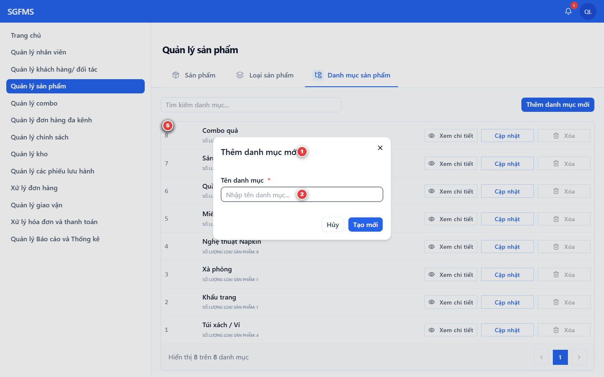

### Bảng mô tả thành phần

| STT | Tên thành phần | Kiểu | Chức năng |
|-----|----------------|------|-----------| 
| 1 | lblTitleNewCat | Title | "Thêm danh mục mới" |
| 2 | txtCategoryName | Input | Tên danh mục. Bắt buộc (*) |
| 3 | txtDetail | Input/Textarea | Mô tả danh mục (tùy chọn) |
| 4 | btnCancel | Button | Nút "Hủy" |
| 5 | btnCreate | Button | Nút "Tạo mới" — gọi `api.categories.create()` |

---

## EditCatDialog – Chỉnh sửa danh mục sản phẩm

**Thuộc trang:** Quản lý danh mục  
**File:** `frontend/src/pages/5.1-category-management-page/EditCatDialog.tsx`  
**Kích hoạt bởi:** Nút `btnUpdateCat` "Cập nhật"

### Hình ảnh minh họa

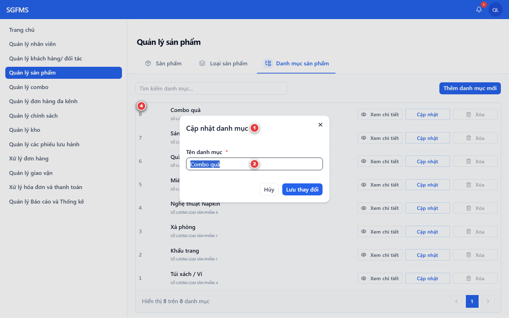

### Bảng mô tả thành phần

| STT | Tên thành phần | Kiểu | Chức năng |
|-----|----------------|------|-----------| 
| 1 | lblTitleEditCat | Title | "Cập nhật danh mục" |
| 2 | txtCategoryName | Input | Tên danh mục. Prefill từ dữ liệu. Bắt buộc (*) |
| 3 | txtDetail | Input | Mô tả. Prefill từ dữ liệu |
| 4 | btnCancel | Button | Nút "Hủy" |
| 5 | btnSave | Button | Nút "Lưu thay đổi" — gọi `api.categories.update()` |

---

## NewProductTypeDialog – Thêm loại sản phẩm mới

**Thuộc trang:** Quản lý sản phẩm — tab Loại sản phẩm (`/product-management?tab=product-types`)  
**File:** `frontend/src/pages/5.2-producttype-management-page/NewProductTypeDialog.tsx`  
**Kích hoạt bởi:** Nút "Thêm mới" trên tab Loại sản phẩm

### Hình ảnh minh họa

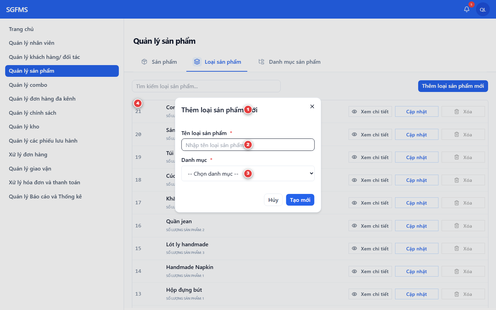

### Bảng mô tả thành phần

| STT | Tên thành phần | Kiểu | Chức năng |
|-----|----------------|------|-----------| 
| 1 | lblTitleNewType | Title | "Thêm loại sản phẩm mới" |
| 2 | txtProductTypeName | Input | Tên loại sản phẩm. Bắt buộc (*) |
| 3 | cboCategoryId | Select | Chọn danh mục cha. Bắt buộc (*). Dữ liệu động từ `api.categories.list()` |
| 4 | btnCancel | Button | Nút "Hủy" |
| 5 | btnCreate | Button | Nút "Tạo mới" — gọi `api.productTypes.create()` |

---

## EditProductDialog – Chỉnh sửa sản phẩm

**Thuộc trang:** Quản lý sản phẩm  
**File:** `frontend/src/pages/6.1-product-management/EditProductDialog.tsx`  
**Kích hoạt bởi:** Dropdown → "Chỉnh sửa"

### Hình ảnh minh họa

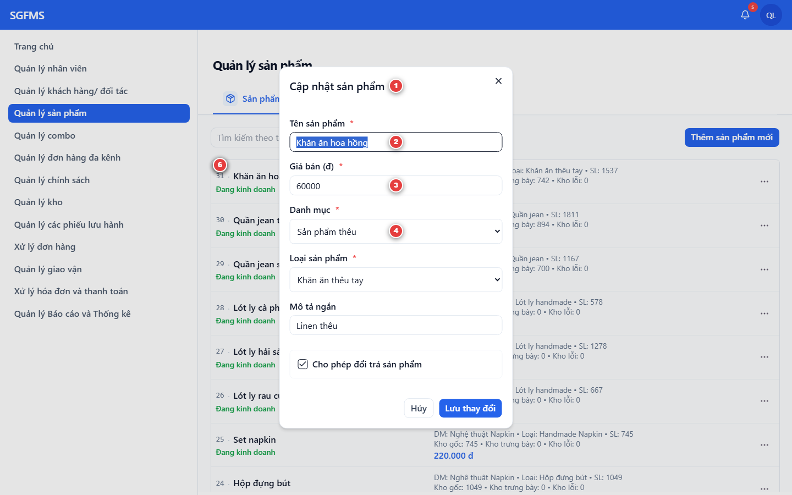

### Bảng mô tả thành phần

| STT | Tên thành phần | Kiểu | Chức năng |
|-----|----------------|------|-----------| 
| 1 | lblTitleEditProduct | Title | "Cập nhật sản phẩm #[ID]" |
| 2 | txtProductName | Input | Tên sản phẩm. Prefill từ dữ liệu. Bắt buộc (*) |
| 3 | txtProductPrice | Input (number) | Giá bán. Prefill, phải > 0 |
| 4 | cboCategoryId | Select | Danh mục. Dữ liệu động |
| 5 | cboProductTypeId | Select | Loại sản phẩm. Dữ liệu động |
| 6 | txtDetail | Input | Mô tả sản phẩm |
| 7 | chkAllowReturn | Checkbox | "Cho phép đổi trả" |
| 8 | btnCancel | Button | Nút "Hủy" |
| 9 | btnSave | Button | Nút "Lưu thay đổi" — gọi `api.products.update()` |

---

## DetailProductDialog – Chi tiết sản phẩm

**Thuộc trang:** Quản lý sản phẩm  
**File:** `frontend/src/pages/6.1-product-management/DetailProductDialog.tsx`  
**Kích hoạt bởi:** Dropdown → "Xem chi tiết"

### Hình ảnh minh họa

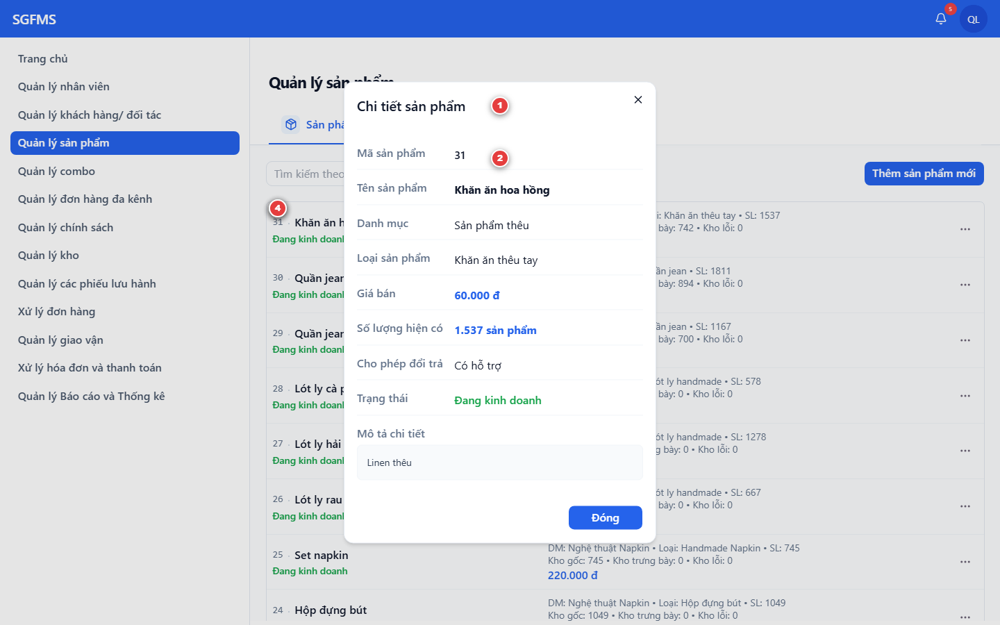

### Bảng mô tả thành phần

| STT | Tên thành phần | Kiểu | Chức năng |
|-----|----------------|------|-----------| 
| 1 | lblTitleDetail | Title | "Chi tiết sản phẩm #[ID]" |
| 2 | lblProductName | Label | Tên sản phẩm (Dữ liệu động) |
| 3 | lblPrice | Label | Giá bán, định dạng VNĐ |
| 4 | lblCategory | Label | Danh mục / Loại sản phẩm |
| 5 | lblStatus | Badge | Trạng thái kinh doanh: Đang kinh doanh (xanh) / Ngừng (đỏ) |
| 6 | tblInventory | Table | Tồn kho theo từng kho: Kho gốc / Kho trưng bày / Kho lỗi |
| 7 | btnClose | Button | Nút "Đóng" |

---

## NewCustomerTypeDialog – Thêm nhóm khách hàng mới

**Thuộc trang:** Quản lý khách hàng — tab Loại khách hàng (`/customer-partner-management?tab=customer-types`)  
**File:** `frontend/src/pages/7.1-customertype-management-page/NewCustomerTypeDialog.tsx`  
**Kích hoạt bởi:** Nút "Thêm mới" tab Loại khách hàng

### Hình ảnh minh họa

### Bảng mô tả thành phần

| STT | Tên thành phần | Kiểu | Chức năng |
|-----|----------------|------|-----------| 
| 1 | lblTitleNewType | Title | "Thêm nhóm khách hàng mới" |
| 2 | txtCustomerTypeName | Input | Tên nhóm khách hàng. Bắt buộc (*) (id="customertypename") |
| 3 | txtDiscount | Input (number) | Chiết khấu (%). Mặc định 0 (id="discount") |
| 4 | txtSpendingLimit | Input (number) | Hạn mức chi tiêu (VNĐ) để tự động xếp vào nhóm này (id="spendinglimit") |
| 5 | txtDetail | Input | Mô tả / chi tiết quyền lợi nhóm (tùy chọn) (id="detail") |
| 6 | btnCancel | Button | Nút "Hủy" |
| 7 | btnCreate | Button | Nút "Tạo mới" — gọi `api.customerTypes.create()` |

---

## NewDiscountDialog – Tạo chương trình khuyến mãi (xem mục 28)

> Đã mô tả ở mục 28. Hình ảnh: `./7-discount-management/NewDiscountDialog.png`

---

## DetailOrderDialog – Chi tiết đơn hàng

**Thuộc trang:** Quản lý đơn hàng  
**File:** `frontend/src/pages/8.2-order-management-page/DetailOrderDialog.tsx`  
**Kích hoạt bởi:** Dropdown → "Xem chi tiết"

### Hình ảnh minh họa

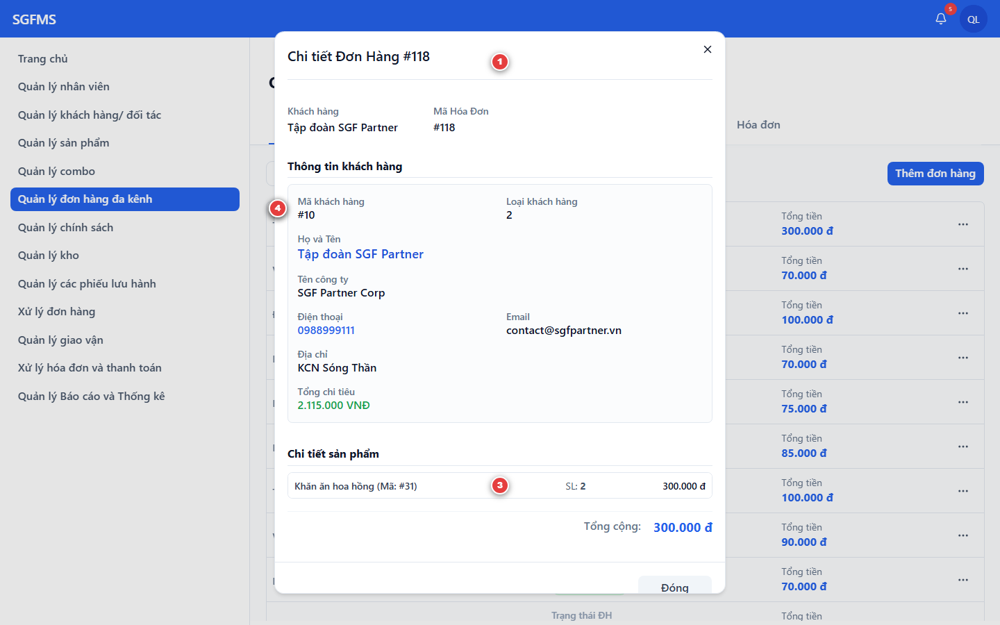

### Bảng mô tả thành phần

| STT | Tên thành phần | Kiểu | Chức năng |
|-----|----------------|------|-----------| 
| 1 | lblTitleDetail | Title | "Chi tiết Đơn hàng #[ID]" |
| 2 | bdgOrderStatus | Badge | Trạng thái đơn hàng theo màu sắc (Dữ liệu động) |
| 3 | lblCustomerInfo | Label Group | Tên KH, địa chỉ giao, SĐT (Dữ liệu động) |
| 4 | tblOrderDetail | Table | Danh sách sản phẩm: Tên SP, SL, Đơn giá, Thành tiền (Dữ liệu động) |
| 5 | panelSummary | Panel | Tạm tính / Thuế / Giảm giá / Phí ship / **TỔNG** |
| 6 | btnClose | Button | Nút "Đóng" |

---

## EditOrderDialog – Cập nhật đơn hàng

**Thuộc trang:** Quản lý đơn hàng  
**File:** `frontend/src/pages/8.2-order-management-page/EditOrderDialog.tsx`  
**Kích hoạt bởi:** Dropdown → "Cập nhật"

### Hình ảnh minh họa

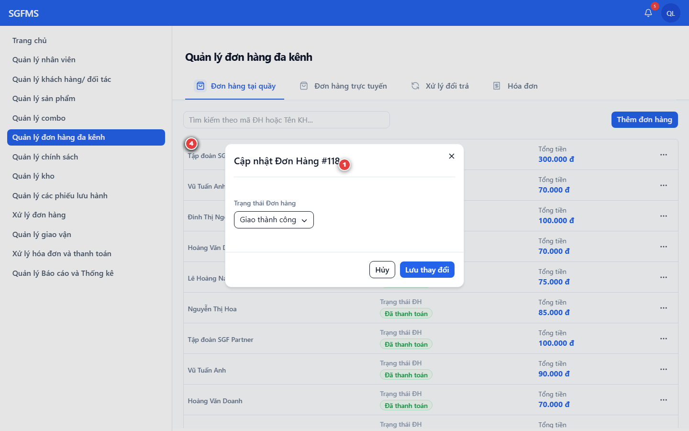

### Bảng mô tả thành phần

| STT | Tên thành phần | Kiểu | Chức năng |
|-----|----------------|------|-----------| 
| 1 | lblTitleEdit | Title | "Cập nhật Đơn Hàng #[ID]" |
| 2 | cboOrderStatus | Select (NativeSelect) | Chỉnh trạng thái đơn hàng: 0=Chờ xác nhận, 1=Đã xác nhận, 2=Đang giao, 3=Giao thành công, 4=Đã hủy, 5=Đổi/trả |
| 3 | cboShippingStatus | Select (NativeSelect) | Chỉnh trạng thái giao hàng (kênh online). **Chỉ hiển thị kênh online (saleChannelCode≠0)** |
| 4 | txtShipCode | Input | Nhập/chỉnh sửa mã vận đơn (kênh online) |
| 5 | txtShipmentNote | Input | Chỉnh sửa ghi chú giao hàng |
| 6 | btnCancel | Button | Nút "Hủy" |
| 7 | btnSave | Button | Nút "Lưu thay đổi" — gọi `api.orders.update()` |

---

## CancelReasonDialog – Nhập lý do hủy đơn hàng

**Thuộc trang:** Quản lý đơn hàng  
**File:** `frontend/src/pages/grouped/CancelReasonDialog.tsx`  
**Kích hoạt bởi:** Dropdown → "Hủy đơn hàng"; hoặc nút "Hủy giao vận" ở Shipping Management

### Hình ảnh minh họa

### Bảng mô tả thành phần

| STT | Tên thành phần | Kiểu | Chức năng |
|-----|----------------|------|-----------| 
| 1 | lblTitleCancel | Title | "Xác nhận hủy đơn hàng #[ID]" hoặc "Hủy giao vận" |
| 2 | lblWarning | Label | Cảnh báo về hậu quả của việc hủy (màu đỏ/amber) |
| 3 | txtReason | Textarea/Input | Nhập lý do hủy. Bắt buộc (*) |
| 4 | btnCancel | Button | Nút "Không, giữ lại" — đóng dialog |
| 5 | btnConfirm | Button | Nút "Xác nhận hủy" (đỏ) — gọi API cập nhật trạng thái hủy |

---

## NewOrderReturnDialog – Tạo phiếu đổi/hoàn trả

**Thuộc trang:** Quản lý đổi trả (`/policy-management?tab=returns`)  
**File:** `frontend/src/pages/9-orderreturn-management-page/NewOrderReturnDialog.tsx`  
**Kích hoạt bởi:** Nút "Tạo phiếu đổi trả mới"

### Hình ảnh minh họa

### Bảng mô tả thành phần

| STT | Tên thành phần | Kiểu | Chức năng |
|-----|----------------|------|-----------| 
| 1 | lblTitleNewReturn | Title | "Tạo phiếu đổi trả mới" |
| 2 | txtOrderName | Input | Nhập mã đơn hàng cần đổi/trả. Bắt buộc (*) |
| 3 | txtEmployeeName | Input | Tên nhân viên xử lý. Tự điền từ context (`emp.Fullname`) |
| 4 | txtReturnRefCode | Input | Mã tham chiếu phiếu (tự sinh `RET` + 6 số ngẫu nhiên) |
| 5 | txtReason | Textarea | Lý do đổi/trả hàng. Bắt buộc (*) |
| 6 | txtTotalRefund | Input (number) | Số tiền hoàn trả cho khách. Bắt buộc (*), phải > 0 |
| 7 | tblReturnProducts | Dynamic Table | (Mỗi dòng) Select sản phẩm + SL + Trạng thái QC + Kho đích + Hành động xử lý + nút Xóa |
| 8 | btnAddProduct | Button | Nút "Thêm sản phẩm" (Plus) — thêm dòng mới |
| 9 | btnCancel | Button | Nút "Hủy" |
| 10 | btnCreate | Button | Nút "Tạo phiếu" — gọi `api.orderReturns.create()` + `api.returnDetails.create()` mỗi dòng |

> **Ghi chú:** Mỗi dòng sản phẩm có 4 select: Sản phẩm, Trạng thái QC ("Đạt chuẩn QC"/"Không đạt QC"), Kho đích, Hành động ("Tái nhập kho"/"Thanh lý").

---

## DetailPolicyDialog – Chi tiết chính sách đổi trả

**Thuộc trang:** Quản lý chính sách  
**File:** `frontend/src/pages/10-policy-management-page/DetailPolicyDialog.tsx`  
**Kích hoạt bởi:** Nút "Chi tiết" tab Chính sách đổi trả

### Hình ảnh minh họa

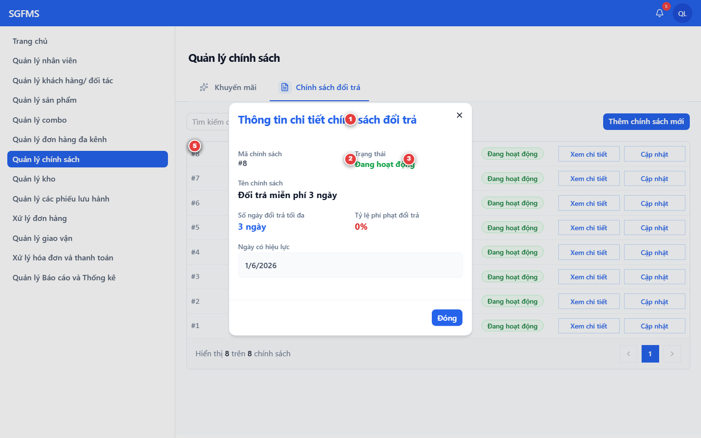

### Bảng mô tả thành phần

| STT | Tên thành phần | Kiểu | Chức năng |
|-----|----------------|------|-----------| 
| 1 | lblTitleDetailPolicy | Title | "Chi tiết chính sách đổi trả" |
| 2 | lblPolicyName | Label | Tên chính sách (Dữ liệu động) |
| 3 | lblMaxReturnDays | Label | Số ngày đổi trả tối đa |
| 4 | lblPenaltyFeeRate | Label | Phí phạt (%) |
| 5 | lblEffectiveDate | Label | Ngày hiệu lực |
| 6 | lblStatus | Badge | Trạng thái: Đang hoạt động (xanh) / Tạm dừng (amber) |
| 7 | btnClose | Button | Nút "Đóng" |

---

## EditPolicyDialog – Chỉnh sửa chính sách đổi trả

**Thuộc trang:** Quản lý chính sách  
**File:** `frontend/src/pages/10-policy-management-page/EditPolicyDialog.tsx`  
**Kích hoạt bởi:** Nút "Chỉnh sửa" trên từng chính sách

### Hình ảnh minh họa

### Bảng mô tả thành phần

| STT | Tên thành phần | Kiểu | Chức năng |
|-----|----------------|------|-----------| 
| 1 | lblTitleEditPolicy | Title | "Cập nhật chính sách đổi trả" |
| 2 | txtPolicyName | Input | Tên chính sách. Prefill từ dữ liệu |
| 3 | txtMaxReturnDays | Input (number) | Số ngày đổi trả. Prefill |
| 4 | txtPenaltyFeeRate | Input (number) | Phí phạt (%). Prefill |
| 5 | dtpEffectiveDate | Input (date) | Ngày hiệu lực. Prefill |
| 6 | cboIsActive | Select | Trạng thái. Prefill |
| 7 | btnCancel | Button | Nút "Hủy" |
| 8 | btnSave | Button | Nút "Lưu thay đổi" — gọi `api.returnPolicies.update()` |

---

## ReportWarehouseDialog – Báo cáo thiếu hụt kho

**Thuộc trang:** Quản lý kho hàng  
**File:** `frontend/src/pages/11.1-warehouse-management-page/ReportWarehouseDialog.tsx`  
**Kích hoạt bởi:** Nút `btnReportWarehouse` "Báo cáo thiếu hụt"

### Hình ảnh minh họa

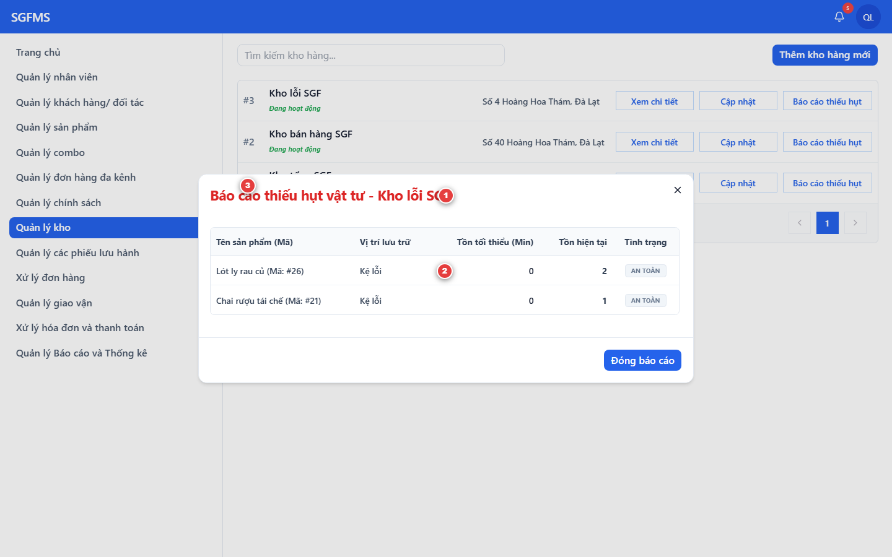

### Bảng mô tả thành phần

| STT | Tên thành phần | Kiểu | Chức năng |
|-----|----------------|------|-----------| 
| 1 | lblTitleReport | Title | "Báo cáo thiếu hụt vật tư – [Tên kho]" màu đỏ |
| 2 | tblInventoryReport | Table | Bảng tồn kho chi tiết: Tên SP (Mã), Vị trí lưu trữ, Tồn tối thiểu (Min), Tồn hiện tại, Tình trạng. Dữ liệu động từ `api.detailInventories.list()` |
| 3 | bdgShortage | Badge | Badge "THIẾU HỤT" (đỏ) khi CurrentQuantity < MinStock. Dòng thiếu hụt tô nền đỏ nhạt |
| 4 | bdgSafe | Badge | Badge "AN TOÀN" (xám) khi đủ tồn kho |
| 5 | btnClose | Button | Nút "Đóng báo cáo" |

> **Ghi chú nghiệp vụ:** Dữ liệu được lọc theo `WarehouseID` của kho đang xem. Dòng nào `CurrentQuantity < MinStock` sẽ được highlight màu đỏ để dễ nhận diện.

---

## DetailRequestDialog – Chi tiết/Phê duyệt yêu cầu bổ sung

**Thuộc trang:** Quản lý phiếu lưu hành  
**File:** `frontend/src/pages/11.2-request-management-page/DetailRequestDialog.tsx`  
**Kích hoạt bởi:** Nút "Xem chi tiết" hoặc "Phê duyệt"

### Hình ảnh minh họa

### Bảng mô tả thành phần

| STT | Tên thành phần | Kiểu | Chức năng |
|-----|----------------|------|-----------| 
| 1 | lblTitleDetail | Title | "Chi tiết Yêu cầu #[ID]" |
| 2 | bdgStatus | Badge | Trạng thái: Đã duyệt (xanh), Chờ duyệt (vàng), Từ chối (đỏ) |
| 3 | lblCreatedBy | Label | Mã nhân viên tạo và ngày tạo (Dữ liệu động) |
| 4 | tblRequestDetail | Table | Danh sách sản phẩm cần bổ sung: Tên SP, Số lượng yêu cầu |
| 5 | cboApproveAction | Select | **Chế độ phê duyệt:** Chọn "Duyệt" hoặc "Từ chối". Chỉ hiện với RoleID=1 khi nhấn "Phê duyệt" |
| 6 | txtRejectReason | Input | **Chế độ phê duyệt:** Lý do từ chối. Chỉ hiện khi chọn "Từ chối" |
| 7 | btnClose | Button | Nút "Đóng" (chế độ xem) |
| 8 | btnConfirmApprove | Button | Nút "Xác nhận" — gọi `api.requestForms.update()` với trạng thái mới (chế độ phê duyệt) |

---

## DetailImportReceiptDialog – Chi tiết/Phê duyệt phiếu nhập kho

**Thuộc trang:** Quản lý phiếu lưu hành  
**File:** `frontend/src/pages/12.1-importreceipt-management-page/DetailImportReceiptDialog.tsx`  
**Kích hoạt bởi:** Nút "Xem chi tiết" hoặc "Phê duyệt"

### Hình ảnh minh họa

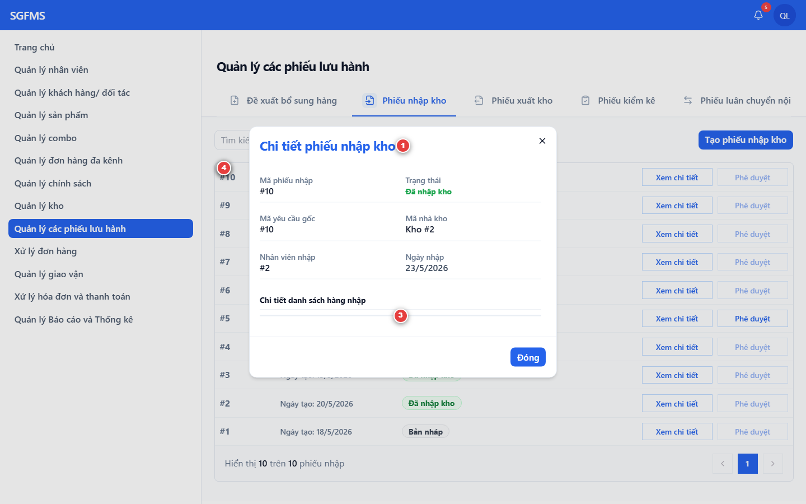

### Bảng mô tả thành phần

| STT | Tên thành phần | Kiểu | Chức năng |
|-----|----------------|------|-----------| 
| 1 | lblTitleDetail | Title | "Chi tiết Phiếu nhập kho #[ID]" |
| 2 | bdgStatus | Badge | Trạng thái phiếu: Bản nháp / Đã nhập kho / Chờ duyệt / Đã từ chối |
| 3 | bdgDiscrepancy | Badge | Badge "Lệch kho" (đỏ) nếu HasDiscrepancy=1 |
| 4 | lblWarehouseInfo | Label | Thông tin kho nhận, mã yêu cầu tham chiếu |
| 5 | tblImportDetail | Table | Danh sách sản phẩm: Tên SP, Số lượng yêu cầu, Số lượng thực nhập. Dòng lệch tô đỏ nhạt |
| 6 | lblDiscrepancyInfo | Label | Lý do chênh lệch + URL ảnh (nếu có) — hiện khi HasDiscrepancy=1 |
| 7 | btnApprove | Button | **Chế độ phê duyệt:** Nút "Duyệt" — gọi `api.importReceipts.approve()`. Chỉ với RoleID=1 |
| 8 | btnReject | Button | **Chế độ phê duyệt:** Nút "Từ chối" — gọi `api.importReceipts.reject()` |
| 9 | btnClose | Button | Nút "Đóng" |

---

## NewExportReceiptDialog – Tạo phiếu xuất kho

**Thuộc trang:** Quản lý phiếu lưu hành — tab Phiếu xuất kho  
**File:** `frontend/src/pages/12.2-exportreceipt-management-page/NewExportReceiptDialog.tsx`  
**Kích hoạt bởi:** Tick chọn đơn hàng → nút "Tạo phiếu xuất"  
**Mô tả:** Dialog tạo phiếu xuất kho gộp nhiều đơn hàng (cùng ĐVVC) thành một phiếu xuất.

### Hình ảnh minh họa

### Bảng mô tả thành phần

| STT | Tên thành phần | Kiểu | Chức năng |
|-----|----------------|------|-----------| 
| 1 | lblTitleNewExport | Title | "Tạo phiếu xuất kho" kèm icon FileOutput |
| 2 | lblShipCompanyInfo | Label | Thông tin ĐVVC của các đơn đã chọn (Dữ liệu động) |
| 3 | tblSelectedOrders | Table | Danh sách đơn hàng đã tick: Mã ĐH, Tên KH, Địa chỉ, Tổng COD. Dữ liệu động |
| 4 | lblProductSummary | Label | Tổng hợp sản phẩm cần xuất: Tên SP + Tổng số lượng (Dữ liệu động) |
| 5 | lblExporterInfo | Label | Thông tin thủ kho lập phiếu (`emp.Fullname`). Dữ liệu động |
| 6 | btnCancel | Button | Nút "Hủy" |
| 7 | btnCreate | Button | Nút "Tạo phiếu xuất" — tổng hợp `orderDetails` → tạo `ExportReceipt` + `ExportDetails`. Hiển thị "Đang tạo..." |

---

## NewCountsheetDialog – Tạo phiếu kiểm kê

**Thuộc trang:** Quản lý phiếu lưu hành — tab Phiếu kiểm kê  
**File:** `frontend/src/pages/15-countsheet-management-page/NewCountsheetDialog.tsx`  
**Kích hoạt bởi:** Nút "Tạo phiếu kiểm kê"

### Hình ảnh minh họa

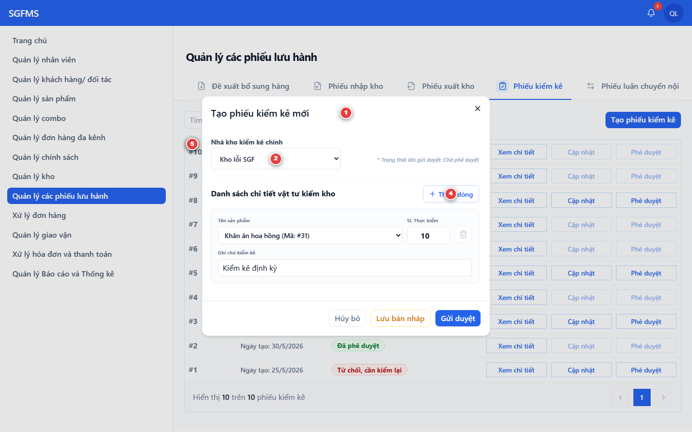

### Bảng mô tả thành phần

| STT | Tên thành phần | Kiểu | Chức năng |
|-----|----------------|------|-----------| 
| 1 | lblTitleNewCountsheet | Title | "Tạo phiếu kiểm kê mới" |
| 2 | cboGlobalWarehouse | Select | Chọn kho kiểm kê toàn cục. Dữ liệu động — chỉ kho Status=1 |
| 3 | tblDetailRows | Dynamic Table | Mỗi dòng: Select kho (sub), Select sản phẩm, Input số lượng, Input ghi chú + nút Xóa |
| 4 | btnAddLine | Button | Nút "Thêm dòng" (Plus) — thêm dòng mới |
| 5 | btnCancel | Button | Nút "Hủy" |
| 6 | btnCreate | Button | Nút "Tạo mới" — gọi `api.countSheets.create()` + `api.countSheetDetails.create()` mỗi dòng |

---

## NewTransferTicketDialog – Tạo phiếu điều chuyển kho

**Thuộc trang:** Quản lý phiếu lưu hành — tab Phiếu điều chuyển  
**File:** `frontend/src/pages/18-transfer-ticket-management/NewTransferTicketDialog.tsx`  
**Kích hoạt bởi:** Nút "Tạo phiếu điều chuyển"  
**Mô tả:** Dialog điều chuyển hàng từ kho tổng sang kho phân phối (hoặc ngược lại).

### Hình ảnh minh họa

### Bảng mô tả thành phần

| STT | Tên thành phần | Kiểu | Chức năng |
|-----|----------------|------|-----------| 
| 1 | lblTitleNewTransfer | Title | "Tạo phiếu điều chuyển kho" |
| 2 | cboSourceId | Select | Chọn kho nguồn. Dữ liệu động — auto-fill kho tổng (WarehouseType=1) |
| 3 | cboDestId | Select | Chọn kho đích. Dữ liệu động — auto-fill kho phân phối (WarehouseType=2) |
| 4 | cboSelectProduct | Select | Chọn sản phẩm để thêm vào danh sách. Dữ liệu động — chỉ SP đang kinh doanh |
| 5 | txtReqQuantity | Input (number) | Số lượng điều chuyển cho sản phẩm đang chọn. Tối thiểu 1 |
| 6 | btnAddItem | Button | Nút "Thêm sản phẩm" — thêm sản phẩm vào danh sách. Validate trùng SP |
| 7 | tblTransferItems | Table | Danh sách sản phẩm cần điều chuyển: Tên SP, SL yêu cầu + nút Xóa |
| 8 | btnCancel | Button | Nút "Hủy" |
| 9 | btnCreate | Button | Nút "Tạo phiếu" — gọi `api.transferTickets.create()` + `api.transferDetails.create()` mỗi dòng. Gán `createdBy: user.employeeId` |

---

## DetailTransferTicketDialog – Chi tiết phiếu điều chuyển

**Thuộc trang:** Quản lý phiếu điều chuyển  
**File:** `frontend/src/pages/18-transfer-ticket-management/DetailTransferTicketDialog.tsx`  
**Kích hoạt bởi:** Nút "Xem chi tiết"

### Hình ảnh minh họa

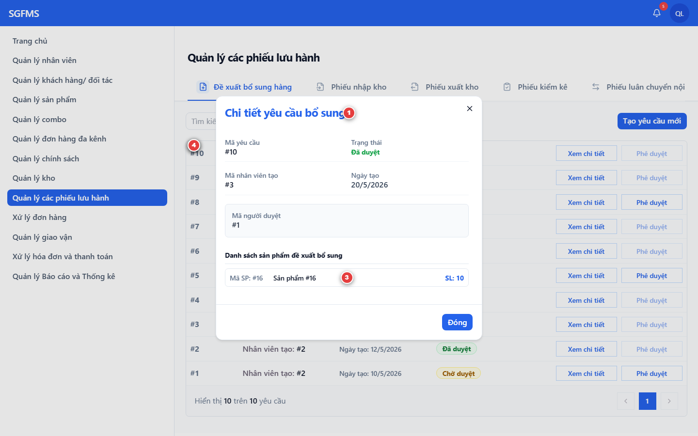

### Bảng mô tả thành phần

| STT | Tên thành phần | Kiểu | Chức năng |
|-----|----------------|------|-----------| 
| 1 | lblTitleDetail | Title | "Chi tiết Phiếu điều chuyển #[ID]" |
| 2 | bdgStatus | Badge | Trạng thái phiếu: Bản nháp / Đã duyệt / Đã từ chối |
| 3 | lblTransferInfo | Label Group | Kho nguồn → Kho đích, Ngày tạo, Người tạo (Dữ liệu động) |
| 4 | tblTransferDetail | Table | Danh sách sản phẩm điều chuyển: Tên SP, SL yêu cầu, SL thực xuất |
| 5 | btnApprove | Button | **Quản lý:** Nút "Phê duyệt" — gọi `api.transferTickets.approve()`. Chỉ RoleID=1 |
| 6 | btnClose | Button | Nút "Đóng" |

## DetailComboDialog – Chi tiết gói sản phẩm Combo

**Thuộc trang:** Quản lý Combo (`/combo-management`)  
**File:** `frontend/src/pages/6.2-combo-management/DetailComboDialog.tsx`  
**Kích hoạt bởi:** Nút "Chi tiết" trên từng dòng combo

### Hình ảnh minh họa

### Bảng mô tả thành phần

| STT | Tên thành phần | Kiểu | Chức năng |
|-----|----------------|------|-----------| 
| 1 | lblTitleDetail | Title | "Chi tiết gói sản phẩm (Combo)" |
| 2 | lblComboId | Label | Mã Combo (`combo.id`) — Dữ liệu động |
| 3 | lblComboPrice | Label | Giá bán gốc combo (đồng) định dạng VNĐ màu xanh — Dữ liệu động |
| 4 | tblComboProducts | Table | Danh sách sản phẩm thành phần: Tên SP + Số lượng. Dữ liệu động từ `api.comboDetails.list()` lọc theo `comboId` |
| 5 | btnClose | Button | Nút "Đóng" (xanh) |

---

## DetailDiscountDialog – Chi tiết mã khuyến mãi

**Thuộc trang:** Quản lý chính sách — tab Khuyến mãi  
**File:** `frontend/src/pages/7.2-discount-management-page/DetailDiscountDialog.tsx`  
**Kích hoạt bởi:** Nút `btnViewDiscount` "Chi tiết"

### Hình ảnh minh họa

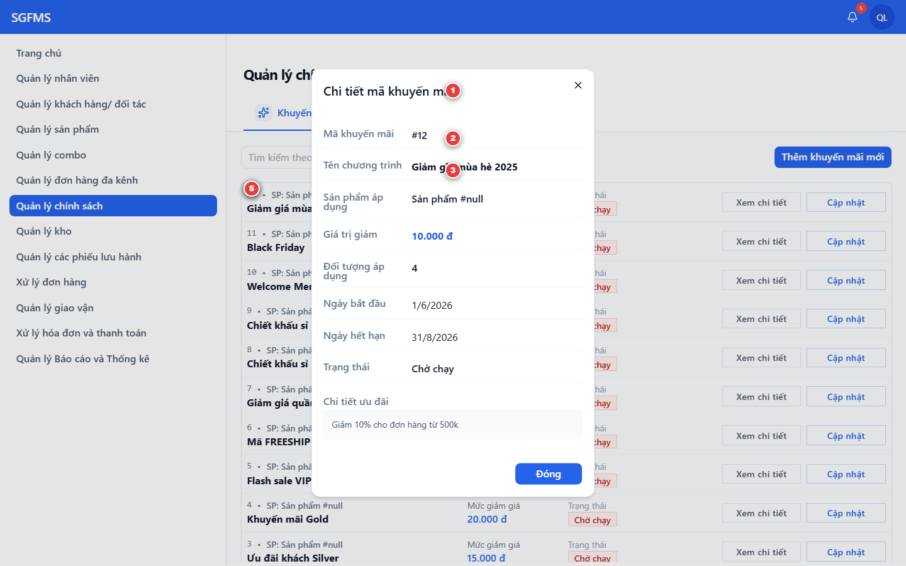

### Bảng mô tả thành phần

| STT | Tên thành phần | Kiểu | Chức năng |
|-----|----------------|------|-----------| 
| 1 | lblTitleDetail | Title | "Chi tiết mã khuyến mãi" |
| 2 | lblDiscountId | Label | Mã khuyến mãi (`#discount.id`) — Dữ liệu động |
| 3 | lblDiscountName | Label | Tên chương trình (`discount.discountname`) — Dữ liệu động |
| 4 | lblAppliedProduct | Label | Tên sản phẩm áp dụng (lookup từ `api.products.list()`) — Dữ liệu động |
| 5 | lblValue | Label | Giá trị giảm (đ) màu xanh (`discount.value`) — Dữ liệu động |
| 6 | lblCustomerType | Label | Đối tượng khách hàng áp dụng (lookup từ `api.customerTypes.list()`) — Dữ liệu động |
| 7 | lblStartDate | Label | Ngày bắt đầu (`discount.startdate`) định dạng vi-VN |
| 8 | lblExpiryDate | Label | Ngày hết hạn (`discount.expirydate`) |
| 9 | lblStatus | Label | Trạng thái: "Chờ chạy" (0) / "Đang chạy" (1) / "Tạm dừng" (2) |
| 10 | lblDetail | Label | Chi tiết ưu đãi/điều kiện áp dụng, hiển thị dạng text trong vùng xám (`discount.detail`) |
| 11 | btnClose | Button | Nút "Đóng" (xanh) |

---

## NewComboDialog – Tạo gói sản phẩm Combo mới

**Thuộc trang:** Quản lý Combo (`/combo-management`)  
**File:** `frontend/src/pages/6.2-combo-management/NewComboDialog.tsx`  
**Kích hoạt bởi:** Nút "Tạo Combo mới"

### Hình ảnh minh họa

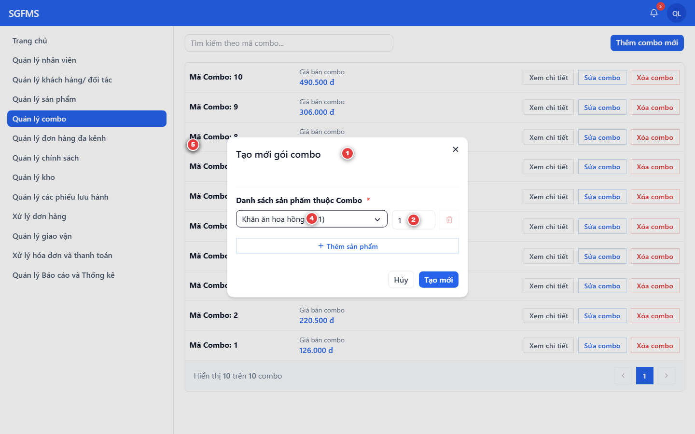

### Bảng mô tả thành phần

| STT | Tên thành phần | Kiểu | Chức năng |
|-----|----------------|------|-----------| 
| 1 | lblTitleNewCombo | Title | "Tạo gói sản phẩm Combo mới" |
| 2 | txtComboName | Input | Tên combo. Bắt buộc (*). Placeholder "Nhập tên combo..." |
| 3 | txtComboPrice | Input (number) | Giá bán combo (đ). Bắt buộc (*), phải > 0 |
| 4 | tblProductRows | Dynamic Table | Mỗi dòng: Select sản phẩm + Input số lượng + nút Xóa. Phải có ít nhất 2 sản phẩm khác nhau |
| 5 | btnAddProduct | Button | Nút "Thêm sản phẩm" — thêm dòng mới vào bảng |
| 6 | btnCancel | Button | Nút "Hủy" |
| 7 | btnCreate | Button | Nút "Tạo Combo" — gọi `api.combos.create()` + `api.comboDetails.create()` mỗi dòng |

---

## DetailCustomerTypeDialog – Chi tiết nhóm khách hàng

**Thuộc trang:** Quản lý khách hàng — tab Loại khách hàng  
**File:** `frontend/src/pages/7.1-customertype-management-page/DetailCustomerTypeDialog.tsx`  
**Kích hoạt bởi:** Nút "Chi tiết" trên từng dòng nhóm khách hàng

### Hình ảnh minh họa

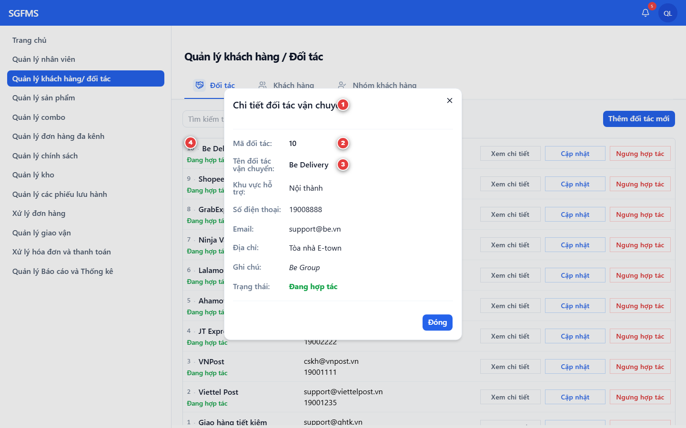

### Bảng mô tả thành phần

| STT | Tên thành phần | Kiểu | Chức năng |
|-----|----------------|------|-----------| 
| 1 | lblTitleDetail | Title | "Chi tiết nhóm khách hàng" |
| 2 | lblCustomerTypeName | Label | Tên nhóm (`customertypename`) — Dữ liệu động |
| 3 | lblDiscount | Label | Chiết khấu (%) áp dụng cho nhóm (`discount`) |
| 4 | lblSpendingLimit | Label | Hạn mức chi tiêu để được xếp vào nhóm (`spendinglimit`) định dạng VNĐ |
| 5 | lblDetail | Label | Mô tả/chi tiết quyền lợi nhóm (`detail`) |
| 6 | btnClose | Button | Nút "Đóng" |

---

## ReturnProductDialog – Ghi nhận trả hàng từ đơn

**Thuộc trang:** Quản lý đơn hàng  
**File:** `frontend/src/pages/8.2-order-management-page/ReturnProductDialog.tsx`  
**Kích hoạt bởi:** Dropdown → "Đổi/Trả hàng" (chỉ đơn có `orderstatus=3` Giao thành công)

### Hình ảnh minh họa

### Bảng mô tả thành phần

| STT | Tên thành phần | Kiểu | Chức năng |
|-----|----------------|------|-----------| 
| 1 | lblTitleReturn | Title | "Xử lý đổi/trả hàng — Đơn #[ID]" |
| 2 | lblOrderInfo | Label | Thông tin tóm tắt đơn hàng gốc (Khách, ngày, tổng tiền) |
| 3 | tblReturnItems | Dynamic Table | Mỗi dòng: Tên SP (readonly), SL đã mua (readonly), Input SL trả lại + nút Xóa |
| 4 | txtRefundAmount | Input (number) | Tổng tiền hoàn trả. Tự tính từ giá SP × SL trả |
| 5 | txtReason | Textarea | Lý do đổi/trả. Bắt buộc (*) |
| 6 | btnCancel | Button | Nút "Hủy" |
| 7 | btnConfirm | Button | Nút "Xác nhận" — tạo phiếu return và cập nhật `orderstatus=5` |

> **Điều kiện:** Chỉ hiện với đơn `orderstatus=3` (Giao thành công) và cho phép đổi trả (`allowReturn=true`)

---

## EditCountsheetDialog – Chỉnh sửa phiếu kiểm kê

**Thuộc trang:** Quản lý phiếu lưu hành — tab Phiếu kiểm kê  
**File:** `frontend/src/pages/15-countsheet-management-page/EditCountsheetDialog.tsx`  
**Kích hoạt bởi:** Nút "Chỉnh sửa" trên phiếu kiểm kê (chỉ Thủ kho)

### Hình ảnh minh họa

### Bảng mô tả thành phần

| STT | Tên thành phần | Kiểu | Chức năng |
|-----|----------------|------|-----------| 
| 1 | lblTitleEdit | Title | "Chỉnh sửa phiếu kiểm kê #[ID]" |
| 2 | cboWarehouseId | Select | Chọn kho. Prefill từ phiếu hiện tại |
| 3 | tblDetailRows | Dynamic Table | Danh sách sản phẩm: Select SP, Input SL thực tế, Input ghi chú + nút Xóa |
| 4 | btnAddLine | Button | Nút "Thêm dòng" — thêm dòng mới |
| 5 | btnCancel | Button | Nút "Hủy" |
| 6 | btnSave | Button | Nút "Lưu thay đổi" — gọi `api.countSheets.update()` + `api.countSheetDetails` |

---

---

## PHỤ LỤC: KIẾN TRÚC VÀ PHÂN QUYỀN

### Kiến trúc phân quyền theo Role

| RoleID | Tên vai trò | Quyền đặc biệt |
|--------|-------------|----------------|
| 1 | Quản lý | Dashboard KPI, Phê duyệt yêu cầu, Phê duyệt phiếu nhập, Xem tất cả màn hình |
| 2 | Thủ kho | Quản lý kho, Phiếu nhập kho (đếm xong), Đẩy đơn giao vận |

| 3 | Nhân viên bán hàng | Quản lý đơn hàng, Hủy giao vận |

### Cấu trúc Route ứng dụng

| Đường dẫn | Component | Loại |
|-----------|-----------|------|
| `/signin` | `SignIn` | Public |
| `/` | `Home` | Private |
| `/profile` | `EmpInfoPage` | Private |
| `/notification-management` | `NotificationManagementPage` | Private |
| `/emp-management` | `EmpManagementPage` | Private |
| `/customer-partner-management` | `CustomerPartnerManagement` (grouped) | Private |
| `/product-management` | `ProductManagementGroup` (grouped) | Private |
| `/multichannel-order-management` | `MultiChannelOrderManagement` (grouped) | Private |
| `/policy-management` | `PolicyManagementGroup` (grouped) | Private |
| `/circulating-slips-management` | `CirculatingSlipsManagement` (grouped) | Private |
| `/warehouse-management` | `WarehouseManagementPage` | Private |
| `/shipping-management` | `ShippingManagementGroup` (grouped) | Private |
| `/report-management` | `ReportManagementGroup` (grouped) | Private |
| `/accounting-management` | `AccountingManagementGroup` (grouped) | Private |

### Thư viện UI sử dụng

- **shadcn/ui**: Card, Button, Input, Table, Badge, Dialog, Label, DatePicker, DropdownMenu
- **lucide-react**: Icon library
- **recharts**: Biểu đồ LineChart, BarChart
- **sonner**: Toast notifications
- **react-router-dom**: Routing
- **Tailwind CSS**: Utility-first styling
